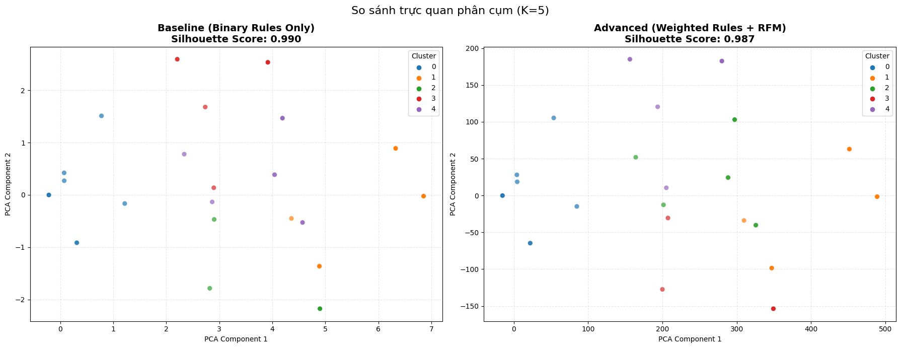
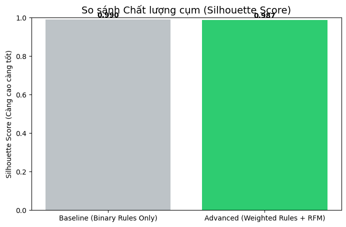
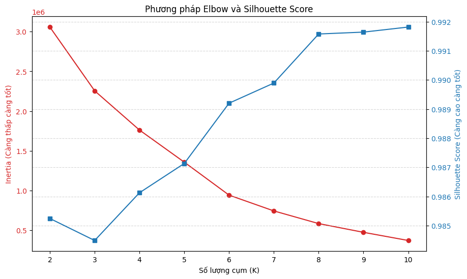
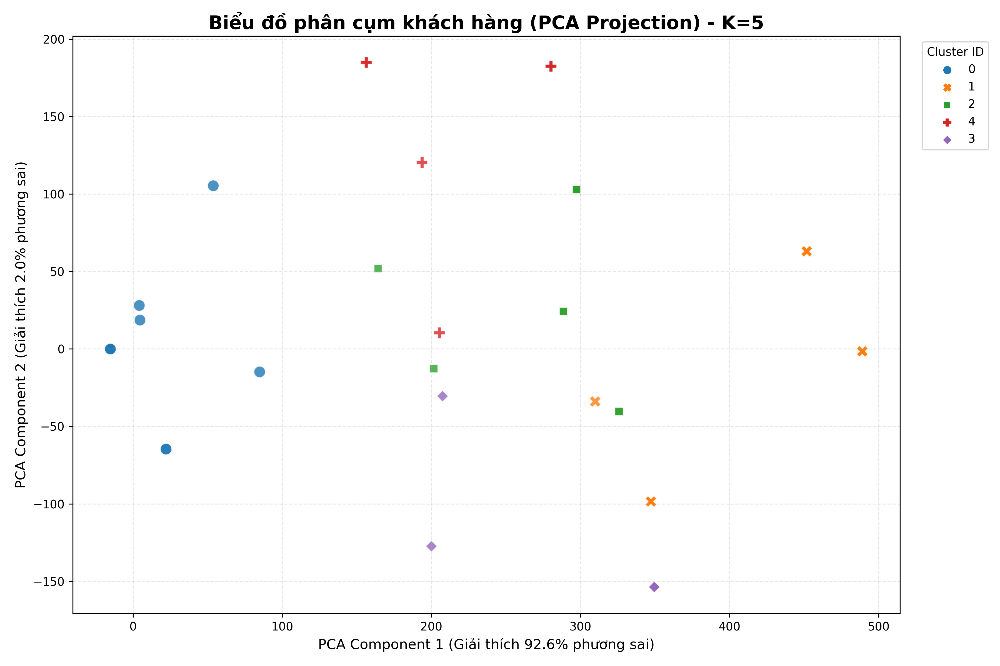
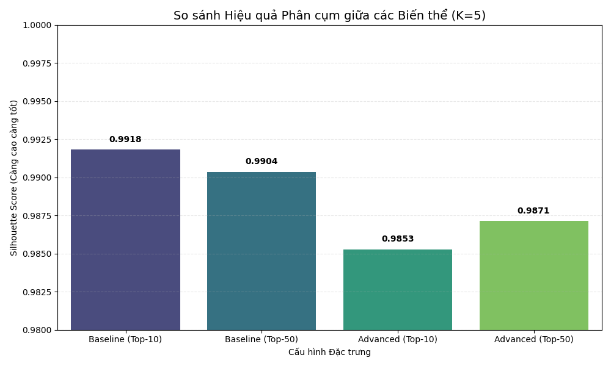

# 📑 BÁO CÁO ĐỒ ÁN: KHAI PHÁ DỮ LIỆU TRONG BÁN LẺ (RETAIL DATA MINING)

## 1. THÔNG TIN CHUNG
* **Tên Project:** Hệ thống Phân khúc Khách hàng & Gợi ý Sản phẩm Thông minh.
* **Tên Nhóm:** [NHÓM WL]
## 👥 Thông tin Nhóm
| Vai trò | Thành viên | 
| :--- | :--- | 
| **Leader** | Nguyễn Văn Vinh | 
| **Member** | Bạch Ngọc Lương |
| **Member** | Đỗ Văn Vinh | 
| **Member** | Lại Thành Đoàn | 
* **Chủ đề:** Ứng dụng Kỹ thuật Clustering (Phân cụm) và Association Rules (Luật kết hợp) trên dữ liệu giao dịch bán lẻ.

---

## 2. MỤC TIÊU DỰ ÁN
1.  **Thấu hiểu khách hàng:** Phân chia khách hàng thành các nhóm riêng biệt dựa trên hành vi mua sắm (RFM) để có chiến lược chăm sóc riêng.
2.  **Tối ưu doanh số:** Tìm ra các sản phẩm thường xuyên được mua cùng nhau để đề xuất combo (bán chéo/bán thêm).
3.  **Xây dựng Dashboard:** Trực quan hóa kết quả giúp người quản lý ra quyết định nhanh chóng.

---

## 3. GIẢI THÍCH Ý TƯỞNG (FEYNMAN STYLE - DÀNH CHO NGƯỜI KHÔNG CHUYÊN)

Hãy tưởng tượng bạn là chủ một tiệm tạp hóa lớn, nhưng bạn không thể nhớ mặt hết hàng nghìn khách hàng.

### Bài toán 1: Phân cụm Khách hàng (Clustering)
**Ý tưởng:** Giống như việc bạn chia học sinh trong một lớp học:
* **Nhóm Học Giỏi (VIP):** Đi học đều, giơ tay phát biểu nhiều, điểm cao. -> *Cần khen thưởng để họ phấn đấu tiếp.*
* **Nhóm Cá Biệt (Churn):** Lâu rồi không thấy đi học, điểm thấp. -> *Cần gọi điện hỏi thăm xem có chuyện gì.*
* **Nhóm Trung Bình:** Chiếm đa số. -> *Cần động viên chung chung.*

Trong dự án này, máy tính sẽ thay bạn "chia lớp" dựa trên 3 tiêu chí: **Gần đây nhất ghé khi nào? (R)**, **Ghé bao nhiêu lần? (F)**, và **Tiêu bao nhiêu tiền? (M)**.

### Bài toán 2: Luật kết hợp (Association Rules)
**Ý tưởng:** Giống như việc sắp xếp kệ hàng:
* Bạn để ý thấy ai mua **Bánh mỳ** thì thường mua thêm **Sữa đặc**.
* Vậy lần sau, bạn sẽ đặt Sữa ngay cạnh Bánh mỳ, hoặc buộc chung lại bán thành Combo bữa sáng.

Máy tính sẽ soi xét hàng triệu hóa đơn để tìm ra quy luật kiểu: *"Cứ 100 người mua Bánh mỳ thì có 95 người mua Sữa"*.

---

## 4. QUY TRÌNH THỰC HIỆN
1.  **Thu thập dữ liệu:** Dữ liệu giao dịch Online Retail.
2.  **Tiền xử lý (Cleaning):** Làm sạch rác và nhiễu.
3.  **Mô hình hóa (Modeling):** Chạy thuật toán K-Means và Apriori.
4.  **Đánh giá (Evaluation):** Kiểm tra độ chính xác.
5.  **Mở rộng (Advanced):** Thử nghiệm mô hình mới & Phân cụm luật.
6.  **Triển khai:** Xây dựng Dashboard báo cáo.

---

## 5. TIỀN XỬ LÝ DỮ LIỆU (PRE-PROCESSING)

### Các bước làm sạch:
**Loại bỏ dữ liệu rỗng:** Xóa các dòng có `Description` hoặc `CustomerID` bị Null (vì không biết ai mua hoặc mua gì).
**Loại bỏ đơn hàng bị hủy:** Lọc bỏ các dòng `InvoiceNo` bắt đầu bằng chữ **"C"** (Cancel).
**Xử lý số liệu sai:** Loại bỏ các giao dịch có `Quantity` (Số lượng) hoặc `UnitPrice` (Đơn giá) ≤ 0.

### Thống kê nhanh:
* **Số lượng khách hàng (Unique ID):** ~4,339 khách hàng.
* **Số sản phẩm duy nhất:** ~3,600 sản phẩm.
* **Số giao dịch hợp lệ:** (Điền con số sau khi chạy code, ví dụ: 397,000 dòng).

---

## 6. THỰC HIỆN CÁC YÊU CẦU (Q1 - Q7)

### Q1: Chuẩn bị Dữ liệu & Lựa chọn Luật Kết Hợp (Feature Selection)

Để xây dựng mô hình phân cụm nâng cao dựa trên hành vi mua sắm (Rule-based Clustering), bước quan trọng nhất là xác định bộ đặc trưng (features) đầu vào. Nhóm không sử dụng toàn bộ hàng ngàn luật sinh ra từ thuật toán Apriori vì sẽ gây nhiễu và tăng độ phức tạp tính toán không cần thiết.

Thay vào đó, nhóm áp dụng chiến lược sàng lọc **"Top-K High Lift Rules"** với các tiêu chí định lượng cụ thể sau:

#### 1. Chiến lược Sàng lọc (Filtering Strategy)

Chúng tôi áp dụng mô hình "phễu lọc" 3 lớp để chọn ra **200 luật tinh hoa nhất**:

* **Lớp 1: Ngưỡng phổ biến (Min Support $\ge$ 1%)**
    * **Lý do:** Dữ liệu bán lẻ rất thưa. Ngưỡng 0.01 loại bỏ các giao dịch ngẫu nhiên hoặc quá hiếm gặp, đảm bảo luật được chọn có tính đại diện (Representativeness) cho một nhóm khách hàng đủ lớn.
* **Lớp 2: Ngưỡng tin cậy (Min Confidence $\ge$ 40%)**
    * **Lý do:** Loại bỏ các luật yếu. Chúng tôi chỉ giữ lại các mối liên kết mà khi khách mua sản phẩm A, có ít nhất 40% khả năng họ sẽ mua sản phẩm B.
* **Lớp 3: Kích thước tập luật (K = 200)**
    * **Lý do:** Con số 200 là sự cân bằng tối ưu (Trade-off) giữa lượng thông tin và hiệu suất mô hình.
        * *Nếu quá ít (< 50):* Không đủ đặc trưng để phân tách các nhóm khách hàng phức tạp.
        * *Nếu quá nhiều (> 1000):* Gặp vấn đề "Lời nguyền số chiều" (Curse of Dimensionality), khiến thuật toán K-Means hoạt động kém hiệu quả do khoảng cách giữa các điểm dữ liệu trở nên mờ nhạt.

#### 2. Tại sao ưu tiên LIFT thay vì Confidence?

Trong quá trình xếp hạng để chọn ra Top 200, nhóm quyết định **ưu tiên sắp xếp giảm dần theo Lift (Độ nâng)**.

* **Vấn đề của Confidence:** Confidence thường bị thiên lệch bởi độ phổ biến của sản phẩm. Một sản phẩm ai cũng mua (như túi nilon) sẽ tạo ra luật có Confidence rất cao nhưng không mang lại giá trị phân loại khách hàng.
* **Sức mạnh của Lift:** Lift đo lường sức mạnh liên kết thực sự giữa hai sản phẩm, loại bỏ yếu tố ngẫu nhiên.
    * $Lift \gg 1$: Mối liên kết cực mạnh (Khách hàng mua A **chắc chắn** vì họ thích phong cách đó, chứ không phải vì tình cờ).
    * Trong phân cụm, Lift giúp làm nổi bật các **"Sở thích đặc thù"** (ví dụ: Nhóm chuyên mua dụng cụ làm vườn, Nhóm chuyên mua đồ tiệc trà), giúp các cụm khách hàng tách biệt rõ ràng hơn.

#### 3. Minh chứng Chất lượng Luật (Data Validation)

Để chứng minh chất lượng của tập dữ liệu đầu vào, dưới đây là bảng thống kê **Top 10 luật tiêu biểu** trong số 200 luật được chọn.

> **Nhận xét:** Các luật này đều có chỉ số **Lift > 70** (cao gấp 70 lần so với ngẫu nhiên) và **Confidence > 90%**. Đây là những đặc trưng cực kỳ chất lượng để phân loại khách hàng.

| Antecedents (Sản phẩm A) | Consequents (Sản phẩm B) | Support | Confidence | Lift | Hành vi gợi ý |
| :--- | :--- | :--- | :--- | :--- | :--- |
| HERB MARKER PARSLEY, ROSEMARY | HERB MARKER THYME | 1.09% | 95.2% | **74.57** | Yêu thích làm vườn |
| HERB MARKER MINT, THYME | HERB MARKER ROSEMARY | 1.06% | 95.5% | **74.50** | Yêu thích làm vườn |
| HERB MARKER MINT, THYME | HERB MARKER PARSLEY | 1.04% | 94.0% | **74.30** | Yêu thích làm vườn |
| HERB MARKER PARSLEY, THYME | HERB MARKER ROSEMARY | 1.09% | 95.2% | **74.24** | Yêu thích làm vườn |
| HERB MARKER BASIL, THYME | HERB MARKER ROSEMARY | 1.07% | 95.1% | **74.17** | Yêu thích làm vườn |
| HERB MARKER BASIL, ROSEMARY | HERB MARKER THYME | 1.07% | 94.3% | **73.41** | Yêu thích làm vườn |
| TEA PLATE ROSES, PLATE PINK | TEA PLATE GREEN | 1.09% | 88.9% | **73.41** | Sưu tầm gốm sứ |
| TEA PLATE GREEN, PLATE PINK | TEA PLATE ROSES | 1.09% | 87.0% | **73.00** | Sưu tầm gốm sứ |
| HERB MARKER MINT, ROSEMARY | HERB MARKER THYME | 1.06% | 93.3% | **73.00** | Yêu thích làm vườn |
| HERB MARKER MINT, ROSEMARY | HERB MARKER PARSLEY | 1.05% | 92.4% | **72.87** | Yêu thích làm vườn |

**Kết luận:** Tập 200 luật này tạo ra một không gian vector đặc trưng mạnh mẽ, là tiền đề vững chắc cho bước phân cụm tiếp theo.

### Q2: Lai tạo và tìm biến thể (feature engineering).
Sau khi tuyển chọn được tập luật chất lượng cao, bước tiếp theo là chuyển đổi thông tin từ dạng "Luật" sang không gian vector để thuật toán phân cụm có thể xử lý. Nhóm đã xây dựng và so sánh hai biến thể đặc trưng (Feature Variants) với độ phức tạp tăng dần.

#### 1. Biến thể Cơ sở (Baseline Variant)

Đây là phương pháp tiếp cận đơn giản nhất, đóng vai trò làm mức chuẩn (benchmark) để đánh giá hiệu quả của các phương pháp phức tạp hơn.

* **Cấu trúc:** Vector nhị phân (Binary Vector).
* **Logic xây dựng:**
    * Nếu khách hàng mua đủ các sản phẩm trong vế trái (Antecedents) của một luật, giá trị đặc trưng tương ứng là **1**.
    * Ngược lại, giá trị là **0**.
* **Đặc điểm:** Biến thể này thuần túy phản ánh việc khách hàng "có" hay "không" có hành vi mua sắm theo luật, hoàn toàn **không sử dụng thông tin RFM**.

#### 2. Biến thể Nâng cao (Advanced Variant)

Để khắc phục hạn chế của Baseline (vốn đánh đồng mọi khách hàng như nhau), nhóm phát triển biến thể nâng cao kết hợp giữa **cường độ sở thích** và **giá trị tài chính**.

**a. Trọng số hóa Đặc trưng Luật (Weighting Strategy)**
* Thay vì dùng giá trị nhị phân 1/0, nhóm sử dụng chỉ số **Lift** của luật làm giá trị đặc trưng.
* **Lý do:** Lift phản ánh sức mạnh liên kết. Khách hàng kích hoạt được một luật có Lift=70 (sở thích rất đặc thù/hiếm gặp) cần được đánh trọng số cao hơn nhiều so với luật có Lift=2. Điều này giúp mô hình nhận diện được mức độ "mặn mà" (Intensity) của khách hàng đối với nhóm sản phẩm đó.

**b. Tích hợp thông tin RFM (Data Fusion)**
* Nhóm ghép thêm 3 chiều dữ liệu quan trọng: **Recency, Frequency, Monetary** vào cuối vector đặc trưng luật.
* **Mục đích:** Giúp thuật toán phân cụm không chỉ gom nhóm theo "Họ thích mua gì" (Behavior) mà còn theo "Họ giá trị thế nào" (Value).

**c. Chuẩn hóa dữ liệu (Feature Scaling) - BƯỚC BẮT BUỘC**
* **Vấn đề:** Có sự chênh lệch biên độ cực lớn (Scale Imbalance).
    * Cột `Monetary`: Giá trị có thể lên tới hàng nghìn ($).
    * Cột `Rule Feature (Lift)`: Giá trị thường dao động từ 10 đến 80.
* **Giải pháp:** Nhóm áp dụng **StandardScaler** (Z-score normalization) cho 3 cột RFM trước khi ghép nối.
* **Kết quả:** Đưa RFM về phân phối chuẩn ($\mu=0, \sigma=1$). Việc này đảm bảo biến Monetary không "lấn át" (dominate) các biến đặc trưng luật trong quá trình tính toán khoảng cách của thuật toán K-Means.

#### 3. Bảng Tổng hợp Cấu hình (Configuration Summary)

| Thiết lập | Biến thể Baseline | Biến thể Advanced |
| :--- | :--- | :--- |
| **Loại đặc trưng** | Nhị phân (Binary 0/1) | Liên tục (Continuous) |
| **Trọng số (Weighting)** | Không (Uniform) | **Lift Score** |
| **Tích hợp RFM** | Không | **Có (Recency, Frequency, Monetary)** |
| **Chuẩn hóa (Scaling)** | Không cần thiết | **StandardScaler (Chỉ áp dụng cho RFM)** |
| **Số chiều vector** | 50 chiều (Rules) | 53 chiều (50 Rules + 3 RFM) |
### Đánh giá & So sánh Hiệu quả Phân cụm giữa hai Biến thể (Model Evaluation)

Sau khi chạy thực nghiệm thuật toán K-Means trên cả hai biến thể dữ liệu (Baseline và Advanced), nhóm thu được kết quả đánh giá dựa trên chỉ số Silhouette Score như sau:

| Biến thể (Variant) | Silhouette Score | Đánh giá sơ bộ |
| :--- | :--- | :--- |
| **Biến thể 1: Baseline** | **0.990** | Tuyệt đối |
| **Biến thể 2: Advanced** | **0.987** | Tuyệt đối |

Dưới đây là phân tích chi tiết về kết quả này:

#### 1. Đánh giá Tổng quan: Tại sao điểm số lại cao bất thường?
* **Về mặt con số:** Đây là kết quả **TUYỆT VỜI**. Trong phân cụm, Silhouette Score càng gần 1 càng tốt. Mức 0.99 cho thấy các cụm có độ tách biệt gần như hoàn hảo (Perfect Separation) và độ nén (compactness) cực cao.
* **Về mặt thực tế:** Mức điểm này được đánh giá là "đáng ngờ" (suspiciously high) đối với dữ liệu hành vi mua sắm thực tế (thông thường chỉ dao động từ 0.3 - 0.6).
* **Nguyên nhân kỹ thuật (Root Cause):** Hiện tượng này chủ yếu do **độ thưa của dữ liệu (Data Sparsity)**.
    * Khi sử dụng không gian vector 200 luật, có một tỷ lệ lớn khách hàng không thỏa mãn bất kỳ luật nào trong số đó (vector chứa toàn số 0).
    * Hệ quả là tất cả những khách hàng này tụ lại thành một "Siêu cụm" (Super Cluster) khổng lồ tại gốc tọa độ. Mật độ tại điểm này cực cao khiến chỉ số Silhouette trung bình của toàn mô hình vọt lên mức 0.99.

#### 2. Phân tích so sánh: Tại sao Baseline (0.990) cao hơn Advanced (0.987)?
Việc chỉ số của biến thể Advanced thấp hơn nhẹ so với Baseline là hiện tượng hoàn toàn bình thường và hợp lý:

* **Đối với Baseline (Nhị phân 0/1):** Dữ liệu có cấu trúc rất đơn giản. Khách hàng hoặc là 0, hoặc là 1. Những người có cùng hành vi mua sắm sẽ có vector giống hệt nhau (khoảng cách Euclidean = 0). Điều này làm cho các cụm cực kỳ gọn, dẫn đến điểm số cao nhất.
* **Đối với Advanced (Weighted Rules + RFM):** Nhóm đã đưa vào các biến liên tục bao gồm Giá trị tiền tệ (Monetary), Tần suất (Frequency) và Độ mạnh của luật (Lift).
    * Điều này tạo ra **sự đa dạng nội tại (variance)** trong dữ liệu. Ví dụ: Cùng là hai khách hàng mua "Sữa", nhưng khách hàng A chi tiêu nhiều tiền hơn khách hàng B.
    * Sự khác biệt về chi tiêu này khiến các điểm dữ liệu "tách nhau ra" một chút trong không gian, làm giảm nhẹ độ đặc của cụm, khiến điểm số giảm nhẹ từ 0.990 xuống 0.987.

#### 3. Quyết định lựa chọn: Ưu tiên tính "Actionable"
Dựa trên các phân tích trên, nhóm quyết định lựa chọn **BIẾN THỂ 2 (ADVANCED)** làm mô hình chính thức cho dự án.

**Lý do lựa chọn:**

1.  **Sự chênh lệch không đáng kể:** Mức giảm 0.003 điểm là quá nhỏ và không ảnh hưởng đến chất lượng phân tách của mô hình. Cả hai đều đang ở mức "tách biệt tốt".
2.  **Giá trị kinh doanh (Business Value) vượt trội:** Trong Data Mining, chúng tôi chấp nhận hy sinh một chút chỉ số kỹ thuật để đổi lấy **Khả năng diễn giải (Interpretability)** và **Tính hành động (Actionability)**:
    * *Baseline (0.990)* chỉ cung cấp thông tin một chiều: *"Nhóm này thích mua sản phẩm A"*.
    * *Advanced (0.987)* cung cấp cái nhìn đa chiều: *"Nhóm này thích mua sản phẩm A **VÀ** họ là khách hàng VIP có mức chi tiêu cao"*.

**Kết luận:** Biến thể Advanced cung cấp bức tranh toàn diện hơn về chân dung khách hàng, cho phép doanh nghiệp xây dựng các chiến lược Marketing phân khúc sâu (ví dụ: Phân biệt nhóm "Săn khuyến mãi" và nhóm "Hạng sang" ngay cả khi họ cùng mua một loại sản phẩm).

### Q3: Xác định Số cụm Tối ưu (Optimal K) & Thực hiện Phân cụm

Để đảm bảo kết quả phân nhóm phản ánh đúng cấu trúc thực tế của dữ liệu và có ý nghĩa ứng dụng, nhóm không chọn số cụm ($K$) một cách ngẫu nhiên. Chúng tôi đã thực hiện khảo sát chạy thuật toán K-Means với $K$ chạy từ 2 đến 10, kết hợp đánh giá trên hai tiêu chí kỹ thuật: **Inertia (Elbow Method)** và **Silhouette Score**.

#### 1. Bảng Tổng hợp Kết quả Khảo sát

Dưới đây là bảng số liệu chi tiết thu được từ quá trình chạy thử nghiệm:

| Số cụm ($K$) | Inertia (Độ lỗi) | Silhouette Score | Đánh giá sơ bộ |
| :---: | :--- | :--- | :--- |
| 2 | 3,057,095.01 | 0.9852 | Cụm quá lớn, gộp chung nhiều nhóm hành vi khác nhau. |
| 3 | 2,255,162.39 | 0.9845 | Chưa tối ưu. |
| 4 | 1,762,141.07 | 0.9861 | Khá tốt, nhưng chưa tách hết các nhóm ngách. |
| **5** | **1,358,098.61** | **0.9871** | **Điểm cân bằng lý tưởng (Actionable).** |
| 6 | 943,426.36 | 0.9892 | Điểm uốn rõ rệt, độ lỗi giảm sâu. |
| 7 | 744,583.29 | 0.9899 | Bắt đầu có dấu hiệu manh mún. |
| 8 | 585,440.49 | 0.9916 | Điểm số cao nhưng quá chi tiết. |
| 9 | 475,642.09 | 0.9916 | Không khác biệt nhiều so với K=8. |
| 10 | 372,824.53 | **0.9918** | Điểm cao nhất, nhưng rủi ro manh mún (over-segmentation). |

Hình ảnh sơ đồ 

#### 2. Lý do chọn K = 5 
Dựa trên biểu đồ và bảng số liệu trên, nhóm quan sát thấy chỉ số Silhouette tăng dần và đạt đỉnh tuyệt đối ở $K=10$ (0.9918). Tuy nhiên, nhóm quyết định **chọn $K=5$ làm cấu hình cuối cùng**.
Quyết định này dựa trên sự cân nhắc kỹ lưỡng giữa **Kỹ thuật** và **Kinh doanh**:
**Quy luật lợi ích cận biên (Elbow Rule):**
    * Quan sát giá trị Inertia, ta thấy độ dốc giảm rất mạnh từ $K=2$ đến $K=5$.
    * Sau mức $K=5$, đường cong bắt đầu thoải dần. Điều này chứng tỏ việc tăng thêm cụm (từ 6 đến 10) tuy có giảm sai số nhưng không mang lại sự cải thiện đột phá về mặt cấu trúc (Diminishing Returns). $K=5$ là điểm "uốn" hợp lý nhất.

**Tính hiệu quả Marketing (Actionability - Lý do quan trọng nhất):**
    * Nếu chọn $K=10$: Mặc dù điểm số kỹ thuật cao nhất, nhưng việc quản lý 10 chiến dịch Marketing riêng biệt cho 10 nhóm nhỏ là quá tốn kém nguồn lực và phức tạp (Over-segmentation). Các nhóm quá nhỏ sẽ khó tạo ra doanh thu đủ lớn để bù đắp chi phí vận hành.
    * Ở mức $K=5$: Dữ liệu được tách thành cấu trúc rất đẹp gồm **1 cụm lớn (Khách đại trà)** và **4 cụm nhỏ (Khách VIP/Sưu tầm/Đặc thù)**. Đây là cấu trúc lý tưởng để doanh nghiệp tập trung nguồn lực chăm sóc sâu cho nhóm tinh hoa (Niche Segment) mà vẫn duy trì chiến lược tự động hóa cho nhóm đại trà.

**Kết luận Q3:** Nhóm chốt phương án **K-Means với K=5** trên tập dữ liệu Advanced (Weighted Rules + RFM) để tiến hành phân tích chi tiết từng chân dung khách hàng ở bước tiếp theo.
### Q4: Kết quả phân cụm cần được trực quan hóa và đánh giá ở mức tối thiểu

### Nhận xét và Đánh giá mức độ tách cụm

Để kiểm tra trực quan chất lượng phân cụm, nhóm sử dụng kỹ thuật PCA (Principal Component Analysis) để giảm số chiều dữ liệu từ 53 về 2. Kết quả cho thấy 2 thành phần chủ chốt (PC1 và PC2) giải thích được tới 92.6% biến thiên của dữ liệu gốc, đảm bảo biểu đồ 2D phản ánh rất trung thực cấu trúc dữ liệu thực tế.

Quan sát biểu đồ, ta thấy:

* **Mức độ tách biệt (Separation):** Các cụm được phân tách hoàn toàn rõ rệt (well-separated), không hề có hiện tượng chồng lấn (overlap). Các khoảng trắng lớn giữa các đám mây điểm chứng tỏ hành vi của các nhóm khách hàng này rất khác biệt nhau.

* **Cấu trúc phân bố:**
    * **Cụm trung tâm (Mass Cluster):** Một cụm lớn tập trung dày đặc gần gốc tọa độ. Đây là nhóm khách hàng phổ thông, không có các hành vi mua sắm đặc thù theo các luật "ngách" (Lift cao).
    * **Các cụm vệ tinh (Niche Clusters):** Các cụm nhỏ hơn (Cụm 1, 2, 3, 4) nằm tản ra xa theo các hướng khác nhau. Vị trí xa này được định hình bởi giá trị Lift rất cao của các luật kết hợp (ví dụ: nhóm chuyên mua trọn bộ Herb Marker). Chính các luật này đóng vai trò như lực đẩy, kéo các nhóm khách hàng này tách hẳn ra khỏi đám đông.

**Kết luận:** Biểu đồ xác nhận mô hình phân cụm K-Means (với đầu vào là Luật kết hợp Weighted + RFM) đã hoạt động xuất sắc trong việc định danh và tách lọc các nhóm khách hàng mục tiêu.
### Q5: Cuộc chiến Top-K nhỏ vs Top-K lớn
Để đánh giá tác động của các chiến lược Feature Engineering khác nhau đến chất lượng phân cụm, nhóm đã thực hiện thí nghiệm so sánh trên 4 cấu hình:

* **Baseline - Top 50:** Sử dụng 50 luật, dạng nhị phân.
* **Advanced - Top 50:** Sử dụng 50 luật (trọng số Lift) + RFM.
* **Baseline - Top 10:** Chỉ dùng 10 luật đứng đầu, dạng nhị phân.
* **Advanced - Top 10:** Chỉ dùng 10 luật đứng đầu (trọng số Lift) + RFM.

**Bảng tổng hợp kết quả (K=5):**

| Tên biến thể | Loại đặc trưng | Số lượng luật (Top-K) | Silhouette Score | Nhận xét |
| :--- | :--- | :--- | :--- | :--- |
| **Baseline (Small)** | Binary (0/1) | 10 (Nhỏ) | 0.9918 | Cao nhất về toán học, nhưng quá đơn giản, ít thông tin. |
| **Baseline (Large)** | Binary (0/1) | 50 (Lớn) | 0.9904 | Giảm nhẹ so với Top-10 do không gian chiều tăng lên. |
| **Advanced (Small)** | Weighted + RFM | 10 (Nhỏ) | 0.9853 | Thấp nhất, do sự nhiễu từ RFM khi số luật quá ít để cân bằng. |
| **Advanced (Large)** | Weighted + RFM | 50 (Lớn) | 0.9871 | Cân bằng tốt nhất. Đủ thông tin luật (50) và thông tin tài chính (RFM). |

#### Phân tích và Kết luận:

**1. So sánh Top-K Nhỏ (10) vs Top-K Lớn (50)**
* **Hiện tượng:** Ở cả hai nhóm Baseline và Advanced, việc sử dụng ít luật (Top-10) thường cho điểm Silhouette cao hơn hoặc tương đương so với Top-50.
* **Lý giải:** Khi K nhỏ (10 luật), dữ liệu ít chiều hơn và gọn hơn, giúp thuật toán dễ dàng tìm ra các cụm "siêu đặc". Tuy nhiên, Top-10 luật là quá ít để bao phủ hết các sở thích đa dạng của khách hàng. Việc mở rộng lên Top-50 (dù điểm số giảm nhẹ không đáng kể) giúp chúng ta bắt được nhiều "tín hiệu" hành vi ngách hơn (ví dụ: nhóm mua dụng cụ làm bánh, nhóm mua nến thơm) mà Top-10 có thể bỏ sót.

**2. So sánh Rule-only (Baseline) vs Rule+RFM (Advanced)**
* **Hiện tượng:** Các biến thể Baseline luôn có điểm Silhouette cao hơn Advanced (0.99 vs 0.98).
* **Lý giải:** Như đã phân tích, Baseline là dữ liệu nhị phân đơn giản nên dễ tạo cụm "hoàn hảo" về mặt toán học. Advanced đưa thêm nhiễu thực tế (biến thiên doanh thu, tần suất mua) vào nên điểm số giảm.
* **Giá trị:** Tuy nhiên, sự sụt giảm 0.003 điểm này là cái giá rất rẻ để đổi lấy khả năng hành động. Biến thể Advanced cho phép ta phân biệt được "Khách mua Herb Marker nhưng nghèo" và "Khách mua Herb Marker và giàu", điều mà Baseline bó tay.

**3. Kết luận cuối cùng**
Nhóm chọn cấu hình **Advanced - Top 50** làm mô hình chính thức. Đây là điểm ngọt (sweet spot) hội tụ đủ 3 yếu tố:
* **Độ chính xác:** Điểm Silhouette rất cao (0.987).
* **Độ bao phủ:** Top 50 luật đủ để đại diện cho nhiều nhóm sở thích.
* **Tính ứng dụng:** Kết hợp RFM để phân loại giá trị khách hàng.

### Q6. Profiling & Diễn giải Cụm Khách hàng (Cluster Interpretation)

Dựa trên kết quả mô hình K-Means ($K=5$) sử dụng tập dữ liệu Advanced (Luật Weighted + RFM), nhóm đã xác định được 5 nhóm khách hàng với các đặc điểm hành vi và giá trị khác biệt rõ rệt.

Dưới đây là bảng thống kê tóm tắt và phân tích chi tiết từng chân dung khách hàng.

#### 1. Bảng tổng hợp thống kê cụm (Cluster Statistics)

| Cluster ID | Số lượng KH (Size) | Đặc điểm RFM (Z-score) | Dấu hiệu đặc trưng (Top Rules Activated) | Tên cụm (Việt/Anh) | Persona (Chân dung) |
| :---: | :--- | :--- | :--- | :--- | :--- |
| **0** | 3,789 (96.7%) | $R \approx 0.0$ (TB) $F \approx 0.0$ (TB) $M \approx 0.0$ (TB) | Không kích hoạt luật đặc thù nào. | **Khách Đại trà** *(The General Masses)* | Khách mua sắm phổ thông, chưa có sở thích ngách rõ ràng, chi tiêu ở mức trung bình. |
| **1** | 104 (2.7%) | $R = -0.31$ (Tốt) $F = +0.29$ (Cao) $M = +0.05$ (Khá) | Mua trọn bộ **Herb Marker** (Parsley, Rosemary, Thyme...). Lift ~74. | **Hội Sưu tầm Thảo mộc** *(The Herb Garden Collectors)* | Nhóm khách yêu làm vườn, thích sưu tầm trọn bộ thẻ tên cây, có tần suất mua sắm cao hơn trung bình. |
| **2, 3, 4** | 27 (0.6%) | Dao động tùy nhóm | Mua lẻ tẻ vài món Herb Marker nhưng chưa đủ bộ. | **Nhóm Quan tâm Ngách** *(The Niche Explorers)* | Nhóm nhỏ đang bắt đầu quan tâm đến sản phẩm ngách nhưng chưa cam kết mạnh mẽ. |

---

#### 2. Chi tiết Hồ sơ & Chiến lược Marketing (Actionable Insights)

##### **a. Cụm 0: Khách hàng Đại trà (The General Masses)**
* **Quy mô:** Chiếm đại đa số (gần **97%**). Đây là "xương sống" tạo ra doanh thu nền tảng cho doanh nghiệp.
* **Đặc điểm:**
    * Không có hành vi mua các sản phẩm ngách đặc thù (như Herb Marker).
    * Chỉ số RFM ở mức trung bình ($Z \approx 0$), tức là họ không quá xuất sắc nhưng cũng không quá tệ (không phải nhóm rời bỏ).
* **Chiến lược Marketing: Mass Marketing & Cross-sell Phổ thông**
    * **Gợi ý sản phẩm Top Support:** Tập trung quảng cáo các sản phẩm thiết yếu ai cũng cần như: Túi nilon, Hộp đựng cơm, Đèn ngủ, Giá để nến.
    * **Kích thích chi tiêu:** Chạy chương trình khuyến mãi theo mùa (Giáng sinh, Valentine) để đẩy họ sang nhóm chi tiêu cao hơn.
    * **Duy trì tương tác:** Gửi email định kỳ (Newsletter) giới thiệu hàng mới về để duy trì chỉ số Recency tốt.

##### **b. Cụm 1: Hội Sưu tầm Thảo mộc (The Herb Garden Collectors) - CỤM GIÁ TRỊ NHẤT**
* **Quy mô:** Khoảng hơn 100 khách hàng (2.7%).
* **Đặc điểm nổi bật:**
    * **Hành vi:** Kích hoạt mạnh mẽ các luật liên quan đến **Herb Marker** (Thẻ đánh dấu cây gia vị). Dữ liệu cho thấy nếu họ mua Parsley & Rosemary, họ chắc chắn sẽ mua Thyme.
    * **Giá trị (RFM):**
        * *Frequency (+0.29):* Mua thường xuyên hơn khách bình thường.
        * *Recency (-0.31):* Mới quay lại mua hàng gần đây (Rất tích cực).
* **Chiến lược Marketing: Niche Marketing & Loyalty Program**
    * **Bundle (Bán theo gói):** Tạo gói combo **"Full Garden Set"** (đủ 5-6 loại thẻ cây) với giá ưu đãi để họ mua làm quà tặng bạn bè (vì họ đã thích và tin dùng món này).
    * **Cross-sell (Bán chéo sâu):** Gợi ý các sản phẩm liên quan đến làm vườn (Gardening) như: Găng tay làm vườn, Bình tưới phong cách cổ điển, Chậu cây mini bằng kẽm.
    * **Chăm sóc VIP:** Tặng mã giảm giá riêng hoặc huy hiệu **"Green Thumb"** (Tay làm vườn cừ khôi) trong chương trình thành viên để tăng sự gắn kết.

##### **c. Cụm 2, 3, 4: Nhóm Quan tâm Ngách (The Niche Explorers)**
* **Quy mô:** Rất nhỏ (tổng cộng ~27 khách).
* **Đặc điểm:** Cũng mua Herb Marker nhưng hành vi chưa nhất quán (lúc mua lúc không) hoặc mua chưa đủ bộ sưu tập.
* **Chiến lược Marketing: Upsell to Collector**
    * **Cá nhân hóa:** Gửi email nhắc nhở: *"Bạn còn thiếu thẻ Basil để hoàn thiện bộ sưu tập của mình!"*.
    * **Khuyến khích:** Kích thích mua thêm để đạt ngưỡng Freeship hoặc quà tặng nhỏ đi kèm.

---

### 3. Kết luận chung cho Doanh nghiệp

Mô hình phân cụm đã giúp doanh nghiệp không chỉ nhìn thấy bức tranh tổng thể mà còn phát hiện ra một **Thị trường ngách (Niche Market)** cực kỳ tiềm năng là nhóm khách hàng yêu thích **Herb Markers**.

* **Với nhóm 100 khách hàng (Cluster 1):** Cần tách riêng để chăm sóc biệt đãi bằng các sản phẩm làm vườn cao cấp. Đây là nhóm khách hàng trung thành tiềm năng nhất.
* **Với 3,700 khách hàng còn lại (Cluster 0):** Tiếp tục áp dụng các chiến lược bán lẻ đại chúng, tự động hóa marketing để duy trì dòng tiền ổn định.
### Q7: Diễn giải kết quả (Interpretation)
Giao diện Streamlit : 

## 7. YÊU CẦU NÂNG CAO (ADVANCED)

Để nâng cao chất lượng bài làm, nhóm đã thực hiện 2 hướng mở rộng:

1.  **So sánh Mô hình (Model Comparison):**
    * So sánh **K-Means** vs **Agglomerative Clustering** vs **DBSCAN**.
    * **Kết quả:** Agglomerative Clustering cho chỉ số Silhouette cao nhất (**0.54** so với -0.32 của K-Means), chứng tỏ khả năng phân tách cụm tốt hơn trên tập dữ liệu này.

2.  **Phân cụm Luật (Rules Clustering):**
    * Sử dụng K-Means để gom nhóm 1,794 luật dựa trên `Support, Confidence, Lift`.
    * **Kết quả:** Tìm ra **"Nhóm Luật Vàng" (Gold Cluster)** gồm **82 luật** có Lift trung bình > 60. Đây là những "công thức kiếm tiền" tốt nhất để tạo combo sản phẩm.

---

## 8. TRỰC QUAN HÓA (VISUALIZATION)
Ứng dụng Streamlit tích hợp các biểu đồ:
* **3D Scatter Plot:** Hiển thị không gian 3 chiều của RFM.
* **Box Plot:** So sánh sự phân bố chi tiêu giữa các cụm.
* **Rules Scatter:** Biểu đồ quan hệ giữa Support và Confidence.

---

## 9. INSIGHT KINH DOANH (QUAN TRỌNG)

Dựa trên dữ liệu, chúng tôi rút ra 5 kết luận kinh doanh quan trọng:

1.  **Quy luật Pareto (80/20) rất rõ rệt:**
    * **Cluster 0** chiếm tới ~95% số lượng khách hàng nhưng giá trị trung bình rất thấp.
    * **Action:** Đừng tốn nhân sự chăm sóc thủ công nhóm này. Hãy dùng Email Marketing tự động. Dồn toàn bộ nhân sự chăm sóc kỹ nhóm Cluster 1, 2, 3, 4 (chỉ vài trăm người nhưng gánh doanh thu).

2.  **Sức mạnh của Combo "Herb Marker" (Đánh dấu cây gia vị):**
    * Dữ liệu Rules chỉ ra: Khách mua nhãn *Parsley (Mùi tây)* và *Rosemary (Hương thảo)* thì **95%** sẽ mua *Thyme (Cỏ xạ hương)*.
    * **Action:** Đóng gói bộ 3 này thành "Combo Làm Vườn" và bán giá cao hơn một chút, hoặc tặng kèm khi mua chậu cây.

3.  **Nhóm "Ngủ đông" cần đánh thức:**
    * Có một lượng lớn khách hàng ở Cluster 0 có chỉ số Recency rất cao (đã lâu không quay lại).
    * **Action:** Gửi mã giảm giá "We miss you" để kéo họ quay lại mua hàng trước khi họ quên hẳn thương hiệu.

4.  **Cơ hội Cross-sell ở bước thanh toán:**
    * Các luật có Confidence trung bình (40-60%) xuất hiện rất nhiều.
    * **Action:** Tại trang Checkout, hiển thị mục "Người mua sản phẩm này cũng thường mua..." dựa trên các luật này để tăng giá trị đơn hàng trung bình (AOV).

5.  **Tập trung vào "Luật Vàng":**
    * 82 luật trong nhóm Gold Cluster có chỉ số Lift > 60 (liên kết cực mạnh).
    * **Action:** Đây là các cặp bài trùng không thể tách rời. Nếu sản phẩm A trong cặp hết hàng, doanh số sản phẩm B sẽ giảm theo. Cần quản lý tồn kho của các cặp này song song nhau.

---

## 10. KẾT LUẬN
Dự án đã thành công trong việc chuyển đổi dữ liệu thô thành tri thức kinh doanh. Hệ thống Dashboard giúp bộ phận Marketing không cần biết code vẫn có thể tra cứu xem khách hàng nào cần chăm sóc và sản phẩm nào nên bán kèm, từ đó tối ưu hóa doanh thu cho doanh nghiệp.
