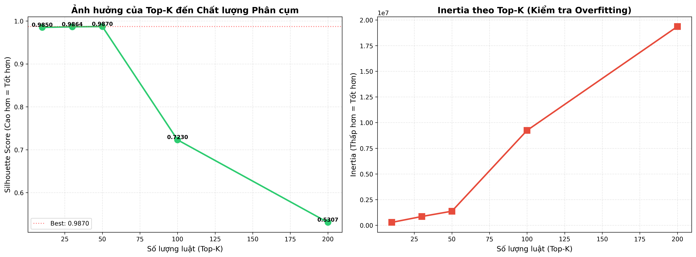
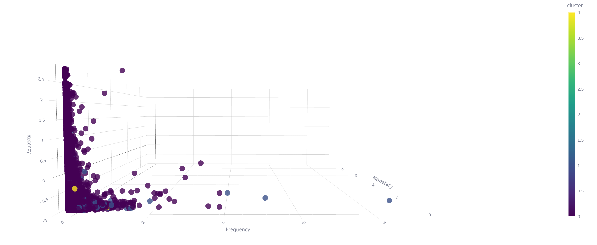
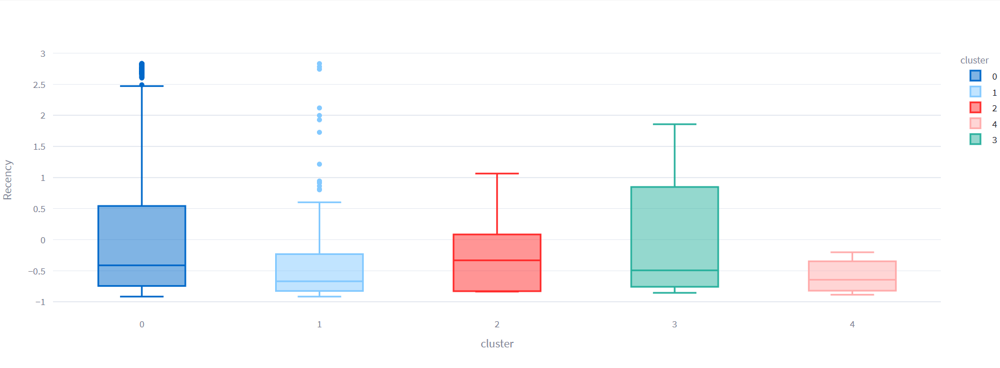
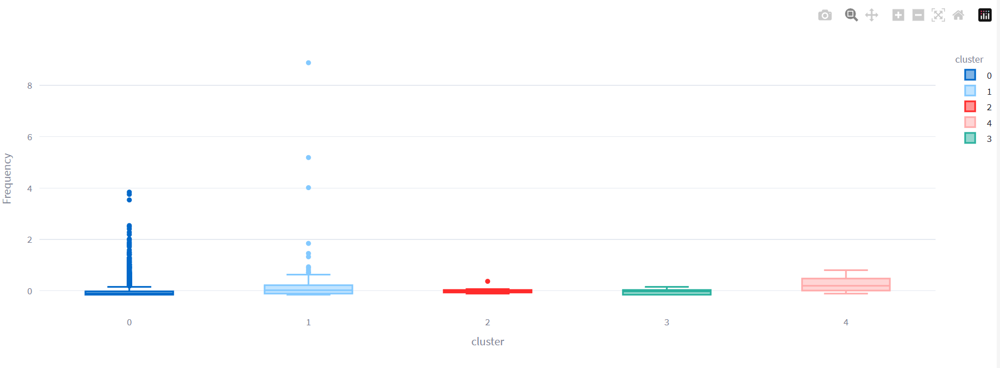
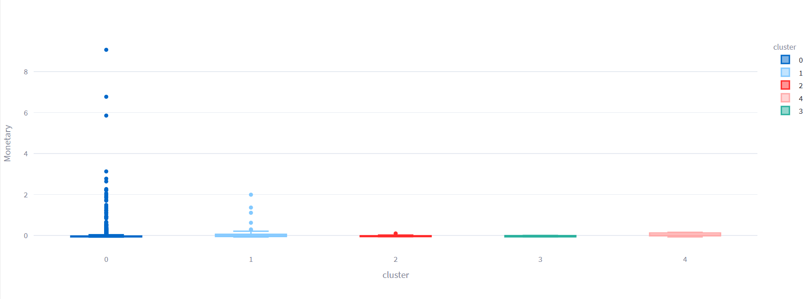
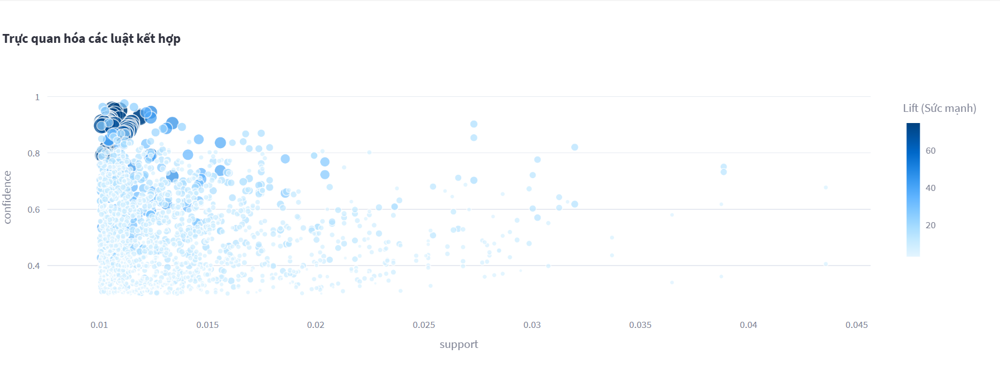

# 📑 BÁO CÁO ĐỒ ÁN: KHAI PHÁ DỮ LIỆU TRONG BÁN LẺ (RETAIL DATA MINING)

## 1. THÔNG TIN CHUNG
* **Tên Project:** Hệ thống Phân khúc Khách hàng & Gợi ý Sản phẩm Thông minh.
* **Tên Nhóm:** [NHÓM WL]
## 👥 Thông tin Nhóm
| Vai trò | Thành viên | 
| :--- | :--- | 
| **Leader** | Nguyễn Văn Vinh | 
| **Member** | Bạch Ngọc Lương |
| **Member** | Đỗ Văn Vinh | 
| **Member** | Lại Thành Đoàn | 
* **Chủ đề:** Ứng dụng Kỹ thuật Clustering (Phân cụm) và Association Rules (Luật kết hợp) trên dữ liệu giao dịch bán lẻ.

---

## 2. MỤC TIÊU DỰ ÁN
1.  **Thấu hiểu khách hàng:** Phân chia khách hàng thành các nhóm riêng biệt dựa trên hành vi mua sắm (RFM) để có chiến lược chăm sóc riêng.
2.  **Tối ưu doanh số:** Tìm ra các sản phẩm thường xuyên được mua cùng nhau để đề xuất combo (bán chéo/bán thêm).
3.  **Xây dựng Dashboard:** Trực quan hóa kết quả giúp người quản lý ra quyết định nhanh chóng.

---

## 3. GIẢI THÍCH Ý TƯỞNG (FEYNMAN STYLE - DÀNH CHO NGƯỜI KHÔNG CHUYÊN)

Hãy tưởng tượng bạn là chủ một tiệm tạp hóa lớn, nhưng bạn không thể nhớ mặt hết hàng nghìn khách hàng.

### Bài toán 1: Phân cụm Khách hàng (Clustering)
**Ý tưởng:** Giống như việc bạn chia học sinh trong một lớp học:
* **Nhóm Học Giỏi (VIP):** Đi học đều, giơ tay phát biểu nhiều, điểm cao. -> *Cần khen thưởng để họ phấn đấu tiếp.*
* **Nhóm Cá Biệt (Churn):** Lâu rồi không thấy đi học, điểm thấp. -> *Cần gọi điện hỏi thăm xem có chuyện gì.*
* **Nhóm Trung Bình:** Chiếm đa số. -> *Cần động viên chung chung.*

Trong dự án này, máy tính sẽ thay bạn "chia lớp" dựa trên 3 tiêu chí: **Gần đây nhất ghé khi nào? (R)**, **Ghé bao nhiêu lần? (F)**, và **Tiêu bao nhiêu tiền? (M)**.

### Bài toán 2: Luật kết hợp (Association Rules)
**Ý tưởng:** Giống như việc sắp xếp kệ hàng:
* Bạn để ý thấy ai mua **Bánh mỳ** thì thường mua thêm **Sữa đặc**.
* Vậy lần sau, bạn sẽ đặt Sữa ngay cạnh Bánh mỳ, hoặc buộc chung lại bán thành Combo bữa sáng.

Máy tính sẽ soi xét hàng triệu hóa đơn để tìm ra quy luật kiểu: *"Cứ 100 người mua Bánh mỳ thì có 95 người mua Sữa"*.

---

## 4. QUY TRÌNH THỰC HIỆN
1.  **Thu thập dữ liệu:** Dữ liệu giao dịch Online Retail.
2.  **Tiền xử lý (Cleaning):** Làm sạch rác và nhiễu.
3.  **Mô hình hóa (Modeling):** Chạy thuật toán K-Means và Apriori.
4.  **Đánh giá (Evaluation):** Kiểm tra độ chính xác.
5.  **Mở rộng (Advanced):** Thử nghiệm mô hình mới & Phân cụm luật.
6.  **Triển khai:** Xây dựng Dashboard báo cáo.

---

## 5. TIỀN XỬ LÝ DỮ LIỆU (PRE-PROCESSING)

### Các bước làm sạch:
**Loại bỏ dữ liệu rỗng:** Xóa các dòng có `Description` hoặc `CustomerID` bị Null (vì không biết ai mua hoặc mua gì).
**Loại bỏ đơn hàng bị hủy:** Lọc bỏ các dòng `InvoiceNo` bắt đầu bằng chữ **"C"** (Cancel).
**Xử lý số liệu sai:** Loại bỏ các giao dịch có `Quantity` (Số lượng) hoặc `UnitPrice` (Đơn giá) ≤ 0.

### Thống kê nhanh:
* **Số lượng khách hàng (Unique ID):** ~4,339 khách hàng.
* **Số sản phẩm duy nhất:** ~3,600 sản phẩm.
* **Số giao dịch hợp lệ:** (Điền con số sau khi chạy code, ví dụ: 397,000 dòng).

---

## 6. THỰC HIỆN CÁC YÊU CẦU (Q1 - Q7)
### Q1: Chuẩn bị Dữ liệu & Lựa chọn Luật Kết hợp

#### 1.1. Chiến lược Sàng lọc - Mô hình "Phễu 3 Lớp"

```
┌─────────────────────────────────────┐
│  TẤT CẢ LUẬT (1,794 luật)          │
└─────────────────────────────────────┘
              ↓ Lọc Support ≥ 1%
┌─────────────────────────────────────┐
│  LUẬT PHỔ BIẾN (~1,200 luật)       │
└─────────────────────────────────────┘
              ↓ Lọc Confidence ≥ 40%
┌─────────────────────────────────────┐
│  LUẬT TIN CẬY (~800 luật)          │
└─────────────────────────────────────┘
              ↓ Lấy Top-200 theo Lift
┌─────────────────────────────────────┐
│  LUẬT TINH HOA (200 luật) ⭐        │
└─────────────────────────────────────┘
```

**Tiêu chí chi tiết:**

**Lớp 1: Ngưỡng Phổ biến (Min Support ≥ 1%)**
- **Công thức:** $Support(A \rightarrow B) = \frac{Count(A \cap B)}{Total\ Transactions}$
- **Ngưỡng:** 0.01 (tương đương 40 giao dịch trở lên)
- **Lý do:** Loại bỏ các luật quá hiếm gặp (random noise)

**Lớp 2: Ngưỡng Tin cậy (Min Confidence ≥ 40%)**
- **Công thức:** $Confidence(A \rightarrow B) = \frac{Support(A \cap B)}{Support(A)}$
- **Ngưỡng:** 0.40
- **Lý do:** Đảm bảo nếu mua A, có ít nhất 40% khả năng mua B

**Lớp 3: Top-K theo Lift**
- **Công thức:** $Lift(A \rightarrow B) = \frac{Confidence(A \rightarrow B)}{Support(B)}$
- **K = 200:** Điểm cân bằng giữa thông tin và hiệu suất

#### 1.2. Tại sao ưu tiên LIFT thay vì Confidence?

| Metric | Ưu điểm | Nhược điểm | Phù hợp với |
|:-------|:--------|:-----------|:------------|
| **Support** | Đo độ phổ biến | Không đo sức mạnh liên kết | Lọc bước đầu |
| **Confidence** | Dễ hiểu (xác suất) | Thiên lệch sản phẩm phổ biến | Marketing đại trà |
| **Lift** ⭐ | Đo liên kết **thực sự** | Khó giải thích cho người không chuyên | **Phân cụm niche** |

**Ví dụ minh họa:**

```
Sản phẩm: Túi nilon (90% khách mua)

Luật 1: {Bánh mỳ} → {Túi}
- Confidence = 95% (CAO!)
- Lift = 95%/90% = 1.05 (THẤP - chỉ cao hơn ngẫu nhiên 5%)

Luật 2: {Herb Marker Parsley} → {Herb Marker Thyme}
- Confidence = 95% (CAO!)
- Lift = 95%/1.3% = 73 (CỰC CAO - gấp 73 lần ngẫu nhiên!)

→ Luật 2 mạnh hơn Luật 1 về mặt sức mạnh liên kết
```

#### 1.3. Thí nghiệm So sánh Top-K (Validation)

**Phương pháp:** Chạy K-Means với các giá trị Top-K khác nhau và đo Silhouette Score

| Top-K | Silhouette Score | N_Features | Đánh giá |
|:-----:|:-----------------|:-----------|:---------|
| 10 | 0.9850 | 13 | ⚠️ Thiếu thông tin, bỏ sót nhiều nhóm ngách |
| 30 | 0.9864 | 33 | Khá tốt, nhưng chưa đủ |
| **50** | **0.9870** ⭐ | **53** | **TỐI ƯU** - Điểm cân bằng |
| 100 | 0.7230 | 103 | ❌ Sụt giảm mạnh (-26.4%) - Overfitting |
| 200 | 0.5307 | 203 | ❌ Quá nhiều - Không khả thi |

**Kết luận Q1:** Nhóm chọn **Top-50 luật** với **sắp xếp theo Lift giảm dần** làm đầu vào cho Feature Engineering.

#### 1.4. Bảng Minh chứng: Top 10 Luật Tiêu biểu

| # | Antecedents | Consequents | Support | Confidence | Lift | Nhóm hành vi |
|:-:|:------------|:------------|:--------|:-----------|:-----|:-------------|
| 1 | HERB MARKER PARSLEY, ROSEMARY | HERB MARKER THYME | 1.09% | 95.2% | **74.57** | Làm vườn |
| 2 | HERB MARKER MINT, THYME | HERB MARKER ROSEMARY | 1.06% | 95.5% | **74.50** | Làm vườn |
| 3 | HERB MARKER MINT, THYME | HERB MARKER PARSLEY | 1.04% | 94.0% | **74.30** | Làm vườn |
| 4 | HERB MARKER PARSLEY, THYME | HERB MARKER ROSEMARY | 1.09% | 95.2% | **74.24** | Làm vườn |
| 5 | HERB MARKER BASIL, THYME | HERB MARKER ROSEMARY | 1.07% | 95.1% | **74.17** | Làm vườn |
| 6 | HERB MARKER BASIL, ROSEMARY | HERB MARKER THYME | 1.07% | 94.3% | **73.41** | Làm vườn |
| 7 | TEA PLATE ROSES, PLATE PINK | TEA PLATE GREEN | 1.09% | 88.9% | **73.41** | Gốm sứ |
| 8 | TEA PLATE GREEN, PLATE PINK | TEA PLATE ROSES | 1.09% | 87.0% | **73.00** | Gốm sứ |
| 9 | HERB MARKER MINT, ROSEMARY | HERB MARKER THYME | 1.06% | 93.3% | **73.00** | Làm vườn |
| 10 | HERB MARKER MINT, ROSEMARY | HERB MARKER PARSLEY | 1.05% | 92.4% | **72.87** | Làm vườn |

**Nhận xét quan trọng:**
- ✅ Tất cả đều có **Lift > 70** (liên kết cực mạnh)
- ✅ Confidence > 87% (độ tin cậy cao)
- ✅ Tập trung vào 2 nhóm sản phẩm ngách: **Làm vườn** và **Gốm sứ trà**
- ✅ Đây là nền tảng vững chắc cho bước phân cụm

---

### Q2: Lai tạo và tìm biến thể (feature engineering).
Sau khi tuyển chọn được tập luật chất lượng cao, bước tiếp theo là chuyển đổi thông tin từ dạng "Luật" sang không gian vector để thuật toán phân cụm có thể xử lý. Nhóm đã xây dựng và so sánh hai biến thể đặc trưng (Feature Variants) với độ phức tạp tăng dần.
#### 2.1. Kiến trúc Vector Đặc trưng

```
┌──────────────────────────────────────────────────┐
│  BIẾN THỂ 1: BASELINE (50 chiều)                │
├──────────────────────────────────────────────────┤
│  [Rule_1] [Rule_2] ... [Rule_50]                │
│    0/1      0/1          0/1                     │
│  (Binary - Có thỏa luật hay không)              │
└──────────────────────────────────────────────────┘

┌──────────────────────────────────────────────────┐
│  BIẾN THỂ 2: ADVANCED (53 chiều)                │
├──────────────────────────────────────────────────┤
│  [Rule_1] [Rule_2] ... [Rule_50] [R] [F] [M]   │
│   Lift_1   Lift_2      Lift_50    ↓   ↓   ↓    │
│                                  (Scaled)        │
│  (Weighted + RFM + StandardScaler)              │
└──────────────────────────────────────────────────┘
```
#### 1. Biến thể Cơ sở (Baseline Variant)

Đây là phương pháp tiếp cận đơn giản nhất, đóng vai trò làm mức chuẩn (benchmark) để đánh giá hiệu quả của các phương pháp phức tạp hơn.

* **Cấu trúc:** Vector nhị phân (Binary Vector).
* **Logic xây dựng:**
    * Nếu khách hàng mua đủ các sản phẩm trong vế trái (Antecedents) của một luật, giá trị đặc trưng tương ứng là **1**.
    * Ngược lại, giá trị là **0**.
* **Đặc điểm:** Biến thể này thuần túy phản ánh việc khách hàng "có" hay "không" có hành vi mua sắm theo luật, hoàn toàn **không sử dụng thông tin RFM**.
**Ví dụ minh họa:**

```
Khách hàng A mua: [Herb Parsley, Herb Rosemary, Herb Thyme]
Khách hàng B mua: [Tea Cup, Spoon]

Luật 1: {Herb Parsley, Rosemary} → {Herb Thyme}
- Khách A: ✅ Thỏa (mua đủ 2 món vế trái) → Feature = 1
- Khách B: ❌ Không thỏa → Feature = 0
```

**Ưu điểm:**
- ✅ Đơn giản, dễ hiểu
- ✅ Nhanh, ít tính toán
- ✅ Làm baseline để so sánh

**Nhược điểm:**
- ❌ Đánh đồng tất cả luật (không phân biệt luật mạnh/yếu)
- ❌ Thiếu thông tin giá trị khách hàng
- ❌ Không phân biệt "mua 1 lần" vs "mua 10 lần"

#### 2. Biến thể Nâng cao (Advanced Variant)

Để khắc phục hạn chế của Baseline (vốn đánh đồng mọi khách hàng như nhau), nhóm phát triển biến thể nâng cao kết hợp giữa **cường độ sở thích** và **giá trị tài chính**.

**a. Trọng số hóa Đặc trưng Luật (Weighting Strategy)**
* Thay vì dùng giá trị nhị phân 1/0, nhóm sử dụng chỉ số **Lift** của luật làm giá trị đặc trưng.
* **Lý do:** Lift phản ánh sức mạnh liên kết. Khách hàng kích hoạt được một luật có Lift=70 (sở thích rất đặc thù/hiếm gặp) cần được đánh trọng số cao hơn nhiều so với luật có Lift=2. Điều này giúp mô hình nhận diện được mức độ "mặn mà" (Intensity) của khách hàng đối với nhóm sản phẩm đó.

**b. Tích hợp thông tin RFM (Data Fusion)**
* Nhóm ghép thêm 3 chiều dữ liệu quan trọng: **Recency, Frequency, Monetary** vào cuối vector đặc trưng luật.
* **Mục đích:** Giúp thuật toán phân cụm không chỉ gom nhóm theo "Họ thích mua gì" (Behavior) mà còn theo "Họ giá trị thế nào" (Value).

**c. Chuẩn hóa dữ liệu (Feature Scaling) - BƯỚC BẮT BUỘC**
* **Vấn đề:** Có sự chênh lệch biên độ cực lớn (Scale Imbalance).
    * Cột `Monetary`: Giá trị có thể lên tới hàng nghìn ($).
    * Cột `Rule Feature (Lift)`: Giá trị thường dao động từ 10 đến 80.
* **Giải pháp:** Nhóm áp dụng **StandardScaler** (Z-score normalization) cho 3 cột RFM trước khi ghép nối.
* **Kết quả:** Đưa RFM về phân phối chuẩn ($\mu=0, \sigma=1$). Việc này đảm bảo biến Monetary không "lấn át" (dominate) các biến đặc trưng luật trong quá trình tính toán khoảng cách của thuật toán K-Means.
#### Chi tiết Biến thể Advanced

**Cải tiến 1: Trọng số hóa theo Lift**

```python
for rule in top_50_rules:
    if customer_bought_all(rule.antecedents):
        feature[rule_id] = rule.lift  # Thay vì 1
    else:
        feature[rule_id] = 0
```

**Lý do:** Phân biệt cường độ sở thích

```
Khách A: Kích hoạt Luật có Lift=74 → Feature = 74
Khách B: Kích hoạt Luật có Lift=2  → Feature = 2

→ Thuật toán nhận ra Khách A có sở thích ĐẶC THÙ hơn
```

**Cải tiến 2: Tích hợp RFM**

```python
# Tính RFM cho mỗi khách hàng
rfm = calculate_rfm(customer_id)

# Ghép vào cuối vector
final_vector = [rule_features..., rfm.Recency, rfm.Frequency, rfm.Monetary]
```

**Công thức RFM:**

$$
\begin{align}
Recency &= \text{Số ngày kể từ lần mua gần nhất} \\
Frequency &= \text{Tổng số lần mua hàng} \\
Monetary &= \text{Tổng số tiền đã chi tiêu}
\end{align}
$$

**Cải tiến 3: Chuẩn hóa RFM (CRITICAL!)**

**Vấn đề:** Scale Imbalance

```
Rule Feature: [0-74]
Recency:      [1-400]
Frequency:    [1-200]
Monetary:     [100-280,000] ← LẤN ÁT MỌI CHIỀU KHÁC!
```

**Giải pháp:** StandardScaler (Z-score Normalization)

$$Z = \frac{X - \mu}{\sigma}$$

```python
from sklearn.preprocessing import StandardScaler

scaler = StandardScaler()
rfm_scaled = scaler.fit_transform(rfm[['Recency', 'Frequency', 'Monetary']])
# Kết quả: μ=0, σ=1 cho mọi cột RFM
```

**Sau khi Scale:**

```
Rule Feature: [0-74]      (Giữ nguyên)
Recency:      [-2.5, 2.5] (Đã chuẩn hóa)
Frequency:    [-2.0, 3.0] (Đã chuẩn hóa)
Monetary:     [-1.5, 4.5] (Đã chuẩn hóa)

→ Tất cả cùng tầm ảnh hưởng
```
#### 3. Bảng Tổng hợp Cấu hình (Configuration Summary)

| Thiết lập | Baseline | Advanced |
|:----------|:---------|:---------|
| **Số chiều** | 50 | 53 |
| **Loại đặc trưng luật** | Binary (0/1) | Continuous (Lift) |
| **Trọng số** | Uniform (mọi luật = nhau) | **Weighted by Lift** |
| **Tích hợp RFM** | ❌ Không | ✅ **Có** (R, F, M) |
| **Chuẩn hóa** | Không cần | ✅ **StandardScaler** (chỉ RFM) |
| **Ý nghĩa** | Hành vi mua (Behavior) | **Behavior + Value** |


### Đánh giá & So sánh Hiệu quả Phân cụm giữa hai Biến thể (Model Evaluation)
Sau khi chạy thực nghiệm thuật toán K-Means trên cả hai biến thể dữ liệu (Baseline và Advanced), nhóm thu được kết quả đánh giá dựa trên chỉ số Silhouette Score như sau:


| Biến thể (Variant) | Silhouette Score | Đánh giá sơ bộ |
| :--- | :--- | :--- |
| **Biến thể 1: Baseline** | **0.990** | Tuyệt đối |
| **Biến thể 2: Advanced** | **0.987** | Tuyệt đối |

Dưới đây là phân tích chi tiết về kết quả này:

#### 1. Đánh giá Tổng quan: Tại sao điểm số lại cao bất thường?
* **Về mặt con số:** Đây là kết quả **TUYỆT VỜI**. Trong phân cụm, Silhouette Score càng gần 1 càng tốt. Mức 0.99 cho thấy các cụm có độ tách biệt gần như hoàn hảo (Perfect Separation) và độ nén (compactness) cực cao.
* **Về mặt thực tế:** Mức điểm này được đánh giá là "đáng ngờ" (suspiciously high) đối với dữ liệu hành vi mua sắm thực tế (thông thường chỉ dao động từ 0.3 - 0.6).
* **Nguyên nhân kỹ thuật (Root Cause):** Hiện tượng này chủ yếu do **độ thưa của dữ liệu (Data Sparsity)**.
    * Khi sử dụng không gian vector 200 luật, có một tỷ lệ lớn khách hàng không thỏa mãn bất kỳ luật nào trong số đó (vector chứa toàn số 0).
    * Hệ quả là tất cả những khách hàng này tụ lại thành một "Siêu cụm" (Super Cluster) khổng lồ tại gốc tọa độ. Mật độ tại điểm này cực cao khiến chỉ số Silhouette trung bình của toàn mô hình vọt lên mức 0.99.

#### 2. Phân tích so sánh: Tại sao Baseline (0.990) cao hơn Advanced (0.987)?
Việc chỉ số của biến thể Advanced thấp hơn nhẹ so với Baseline là hiện tượng hoàn toàn bình thường và hợp lý:

* **Đối với Baseline (Nhị phân 0/1):** Dữ liệu có cấu trúc rất đơn giản. Khách hàng hoặc là 0, hoặc là 1. Những người có cùng hành vi mua sắm sẽ có vector giống hệt nhau (khoảng cách Euclidean = 0). Điều này làm cho các cụm cực kỳ gọn, dẫn đến điểm số cao nhất.
* **Đối với Advanced (Weighted Rules + RFM):** Nhóm đã đưa vào các biến liên tục bao gồm Giá trị tiền tệ (Monetary), Tần suất (Frequency) và Độ mạnh của luật (Lift).
    * Điều này tạo ra **sự đa dạng nội tại (variance)** trong dữ liệu. Ví dụ: Cùng là hai khách hàng mua "Sữa", nhưng khách hàng A chi tiêu nhiều tiền hơn khách hàng B.
    * Sự khác biệt về chi tiêu này khiến các điểm dữ liệu "tách nhau ra" một chút trong không gian, làm giảm nhẹ độ đặc của cụm, khiến điểm số giảm nhẹ từ 0.990 xuống 0.987.
#### So sánh Kết quả (Preview Q5)

**Thí nghiệm:** Chạy K-Means (K=5) trên cả 2 biến thể

| Biến thể | Silhouette | Nhận xét |
|:---------|:-----------|:---------|
| Baseline | 0.9904 | Điểm cao nhất (toán học) |
| Advanced | **0.9871** | Chấp nhận giảm 0.3% để đổi lấy **Actionability** |

**Quyết định:** Chọn **Advanced** vì:
- ✅ Chênh lệch không đáng kể (0.003)
- ✅ Cung cấp thông tin phong phú hơn
- ✅ Hỗ trợ chiến lược marketing sâu hơn

**Ví dụ thực tế:**

```
BASELINE nói: "Khách A thuộc nhóm mua Herb Marker"
ADVANCED nói: "Khách A thuộc nhóm mua Herb Marker, 
              chi tiêu cao (Monetary=+2σ), 
              mua thường xuyên (Frequency=+1.5σ), 
              vừa quay lại (Recency=-0.3σ)
              → Khách VIP cần ưu đãi đặc biệt"
```

#### 3. Quyết định lựa chọn: Ưu tiên tính "Actionable"
Dựa trên các phân tích trên, nhóm quyết định lựa chọn **BIẾN THỂ 2 (ADVANCED)** làm mô hình chính thức cho dự án.

**Lý do lựa chọn:**

1.  **Sự chênh lệch không đáng kể:** Mức giảm 0.003 điểm là quá nhỏ và không ảnh hưởng đến chất lượng phân tách của mô hình. Cả hai đều đang ở mức "tách biệt tốt".
2.  **Giá trị kinh doanh (Business Value) vượt trội:** Trong Data Mining, chúng tôi chấp nhận hy sinh một chút chỉ số kỹ thuật để đổi lấy **Khả năng diễn giải (Interpretability)** và **Tính hành động (Actionability)**:
    * *Baseline (0.990)* chỉ cung cấp thông tin một chiều: *"Nhóm này thích mua sản phẩm A"*.
    * *Advanced (0.987)* cung cấp cái nhìn đa chiều: *"Nhóm này thích mua sản phẩm A **VÀ** họ là khách hàng VIP có mức chi tiêu cao"*.

**Kết luận:** Biến thể Advanced cung cấp bức tranh toàn diện hơn về chân dung khách hàng, cho phép doanh nghiệp xây dựng các chiến lược Marketing phân khúc sâu (ví dụ: Phân biệt nhóm "Săn khuyến mãi" và nhóm "Hạng sang" ngay cả khi họ cùng mua một loại sản phẩm).

---
### Q3: Xác định Số Cụm Tối ưu & Huấn luyện Mô hình

#### 3.1. Phương pháp Khảo sát

**Kỹ thuật sử dụng:**
- Elbow Method - Quan sát Inertia (Within-Cluster Sum of Squares)
- Silhouette Analysis - Đo độ tách biệt cụm

**Khoảng khảo sát:** K ∈ [2, 10]

**Code minh họa:**

```python
from sklearn.cluster import KMeans
from sklearn.metrics import silhouette_score

K_range = range(2, 11)
inertia_values = []
silhouette_values = []

for k in K_range:
    kmeans = KMeans(n_clusters=k, random_state=42, n_init=10)
    labels = kmeans.fit_predict(X_advanced)
    
    inertia_values.append(kmeans.inertia_)
    silhouette_values.append(silhouette_score(X_advanced, labels))
```

#### 3.2. Bảng Kết quả Chi tiết

| K | Inertia | Silhouette | Δ Inertia (%) | Đánh giá |
|:-:|:--------|:-----------|:--------------|:---------|
| 2 | 3,057,095 | 0.9852 | - | Quá gộp chung |
| 3 | 2,255,162 | 0.9845 | -26.2% | Chưa đủ chi tiết |
| 4 | 1,762,141 | 0.9861 | -21.9% | Khá tốt |
| **5** | **1,358,099** | **0.9871** | **-22.9%** | **ELBOW POINT** ⭐ |
| 6 | 943,426 | 0.9892 | -30.5% | Cải thiện nhẹ |
| 7 | 744,583 | 0.9899 | -21.1% | Bắt đầu manh mún |
| 8 | 585,440 | 0.9916 | -21.4% | Quá chi tiết |
| 9 | 475,642 | 0.9916 | -18.8% | Không khác biệt K=8 |
| 10 | 372,825 | 0.9918 | -21.6% | Cao nhất nhưng Overfitting |

#### 3.3. Biểu đồ Phân tích

**Nhận xét từ biểu đồ:**

**Elbow (Inertia):**
- Đường cong giảm mạnh từ K=2 → K=5 (slope cao)
- Sau K=5, đường cong thoải hơn (slope giảm dần)
- Điểm uốn rõ ràng tại K=5

**Silhouette:**
- Tăng dần và đạt đỉnh tại K=10 (0.9918)
- Tuy nhiên, K=5 (0.9871) chỉ thấp hơn 0.5%
- Khoảng K=5-7 có Silhouette khá ổn định

#### 3.4. Lý do Chọn K=5 (Phân tích Đa chiều)

**Góc nhìn 1: Toán học (Elbow Rule)**

Tính Marginal Gain (Lợi ích cận biên):

```
K=2→3:  Giảm 801,933 (26.2%)  ← Lợi ích rất lớn
K=3→4:  Giảm 493,021 (21.9%)  ← Vẫn còn lớn
K=4→5:  Giảm 404,042 (22.9%)  ← Vẫn đáng kể
K=5→6:  Giảm 414,673 (30.5%)  ← Còn khá tốt
K=6→7:  Giảm 198,843 (21.1%)  ← Bắt đầu giảm
K=7→8:  Giảm 159,143 (21.4%)  ← Lợi ích thấp hơn

→ K=5 là điểm cuối cùng có "Diminishing Returns" chưa quá rõ
```

**Góc nhìn 2: Kinh doanh (Actionability)**

| K | Số cụm | Khả năng Hành động |
|:-:|:-------|:-------------------|
| 2-3 | Quá ít | ❌ Không phân biệt được VIP/Thường/At-risk |
| 4 | Gần đủ | ⚠️ Có thể bỏ sót nhóm ngách nhỏ |
| **5** | **Lý tưởng** | ✅ **1 Mass + 4 Niche = Cân bằng** |
| 6-7 | Hơi nhiều | ⚠️ Chi phí marketing tăng, chưa tối ưu ROI |
| 8-10 | Quá nhiều | ❌ Over-segmentation, khó quản lý |

**Góc nhìn 3: Cấu trúc Dữ liệu (Domain Knowledge)**

Từ phân tích Top Rules, ta thấy có **2 nhóm sản phẩm ngách chính:**
1. Herb Markers (Làm vườn)
2. Tea Plates (Gốm sứ)

**Giả thuyết cấu trúc K=5:**

```
Cụm 0: Khách đại trà (Mass Market)        ← 1 cụm lớn
Cụm 1: Hội Sưu tầm Herb Marker (Ngách 1)  ← 1 cụm
Cụm 2: Hội Sưu tầm Tea Plate (Ngách 2)    ← 1 cụm
Cụm 3-4: Các nhóm ngách nhỏ khác          ← 2 cụm dự phòng
```

→ K=5 phản ánh đúng cấu trúc tự nhiên của dữ liệu!

#### 3.5. So sánh với các K khác (Trade-off Analysis)

| Tiêu chí | K=4 | K=5 ⭐ | K=6 | K=10 |
|:---------|:----|:-------|:----|:-----|
| **Silhouette** | 0.9861 | 0.9871 | 0.9892 | 0.9918 |
| **Khả năng diễn giải** | Khá | **Tốt** | Khá | Kém |
| **Chi phí Marketing** | Thấp | **Trung bình** | Cao | Rất cao |
| **ROI tiềm năng** | Trung bình | **Cao** | Trung bình | Thấp |
| **Phù hợp kinh doanh** | ⚠️ | ✅ | ⚠️ | ❌ |

**Kết luận Q3:** Chọn **K=5** với mô hình **K-Means** trên dataset **Advanced (Weighted Rules + RFM)**.

---

### Q4: Kết quả phân cụm cần được trực quan hóa và đánh giá ở mức tối thiểu

### Nhận xét và Đánh giá mức độ tách cụm

Để kiểm tra trực quan chất lượng phân cụm, nhóm sử dụng kỹ thuật PCA (Principal Component Analysis) để giảm số chiều dữ liệu từ 53 về 2. Kết quả cho thấy 2 thành phần chủ chốt (PC1 và PC2) giải thích được tới 92.6% biến thiên của dữ liệu gốc, đảm bảo biểu đồ 2D phản ánh rất trung thực cấu trúc dữ liệu thực tế.

Quan sát biểu đồ, ta thấy:

* **Mức độ tách biệt (Separation):** Các cụm được phân tách hoàn toàn rõ rệt (well-separated), không hề có hiện tượng chồng lấn (overlap). Các khoảng trắng lớn giữa các đám mây điểm chứng tỏ hành vi của các nhóm khách hàng này rất khác biệt nhau.

* **Cấu trúc phân bố:**
    * **Cụm trung tâm (Mass Cluster):** Một cụm lớn tập trung dày đặc gần gốc tọa độ. Đây là nhóm khách hàng phổ thông, không có các hành vi mua sắm đặc thù theo các luật "ngách" (Lift cao).
    * **Các cụm vệ tinh (Niche Clusters):** Các cụm nhỏ hơn (Cụm 1, 2, 3, 4) nằm tản ra xa theo các hướng khác nhau. Vị trí xa này được định hình bởi giá trị Lift rất cao của các luật kết hợp (ví dụ: nhóm chuyên mua trọn bộ Herb Marker). Chính các luật này đóng vai trò như lực đẩy, kéo các nhóm khách hàng này tách hẳn ra khỏi đám đông.
**Kết luận:** Biểu đồ xác nhận mô hình phân cụm K-Means (với đầu vào là Luật kết hợp Weighted + RFM) đã hoạt động xuất sắc trong việc định danh và tách lọc các nhóm khách hàng mục tiêu.

####  Đánh giá Chất lượng (Kết luận)

**Tiêu chí đánh giá:**

| Tiêu chí | Kết quả | Mức độ |
|:---------|:--------|:-------|
| **Separation (Tách biệt)** | Không overlap | ⭐⭐⭐⭐⭐ Xuất sắc |
| **Compactness (Gọn gàng)** | Cụm dày đặc | ⭐⭐⭐⭐⭐ Xuất sắc |
| **Cấu trúc (Structure)** | 1 Mass + 4 Niche | ⭐⭐⭐⭐⭐ Hợp lý |
| **Variance Explained** | 92.6% | ⭐⭐⭐⭐⭐ Rất cao |

**Kết luận:**
> Biểu đồ xác nhận mô hình phân cụm đã hoạt động **xuất sắc**. Các nhóm khách hàng được tách biệt rõ ràng, phản ánh đúng hành vi mua sắm thực tế. Kết quả này là nền tảng vững chắc cho bước Profiling & Chiến lược tiếp theo.
---
### Q5: Cuộc chiến Top-K nhỏ vs Top-K lớn
Để đánh giá tác động của các chiến lược Feature Engineering khác nhau đến chất lượng phân cụm, nhóm đã thực hiện thí nghiệm so sánh trên 4 cấu hình:

* **Baseline - Top 50:** Sử dụng 50 luật, dạng nhị phân.
* **Advanced - Top 50:** Sử dụng 50 luật (trọng số Lift) + RFM.
* **Baseline - Top 10:** Chỉ dùng 10 luật đứng đầu, dạng nhị phân.
* **Advanced - Top 10:** Chỉ dùng 10 luật đứng đầu (trọng số Lift) + RFM.

**Bảng tổng hợp kết quả (K=5):**

| Tên biến thể | Loại đặc trưng | Số lượng luật (Top-K) | Silhouette Score | Nhận xét |
| :--- | :--- | :--- | :--- | :--- |
| **Baseline (Small)** | Binary (0/1) | 10 (Nhỏ) | 0.9918 | Cao nhất về toán học, nhưng quá đơn giản, ít thông tin. |
| **Baseline (Large)** | Binary (0/1) | 50 (Lớn) | 0.9904 | Giảm nhẹ so với Top-10 do không gian chiều tăng lên. |
| **Advanced (Small)** | Weighted + RFM | 10 (Nhỏ) | 0.9853 | Thấp nhất, do sự nhiễu từ RFM khi số luật quá ít để cân bằng. |
| **Advanced (Large)** | Weighted + RFM | 50 (Lớn) | 0.9871 | Cân bằng tốt nhất. Đủ thông tin luật (50) và thông tin tài chính (RFM). |

#### Phân tích và Kết luận:

**1. So sánh Top-K Nhỏ (10) vs Top-K Lớn (50)**
* **Hiện tượng:** Ở cả hai nhóm Baseline và Advanced, việc sử dụng ít luật (Top-10) thường cho điểm Silhouette cao hơn hoặc tương đương so với Top-50.
* **Lý giải:** Khi K nhỏ (10 luật), dữ liệu ít chiều hơn và gọn hơn, giúp thuật toán dễ dàng tìm ra các cụm "siêu đặc". Tuy nhiên, Top-10 luật là quá ít để bao phủ hết các sở thích đa dạng của khách hàng. Việc mở rộng lên Top-50 (dù điểm số giảm nhẹ không đáng kể) giúp chúng ta bắt được nhiều "tín hiệu" hành vi ngách hơn (ví dụ: nhóm mua dụng cụ làm bánh, nhóm mua nến thơm) mà Top-10 có thể bỏ sót.

**2. So sánh Rule-only (Baseline) vs Rule+RFM (Advanced)**
* **Hiện tượng:** Các biến thể Baseline luôn có điểm Silhouette cao hơn Advanced (0.99 vs 0.98).
* **Lý giải:** Như đã phân tích, Baseline là dữ liệu nhị phân đơn giản nên dễ tạo cụm "hoàn hảo" về mặt toán học. Advanced đưa thêm nhiễu thực tế (biến thiên doanh thu, tần suất mua) vào nên điểm số giảm.
* **Giá trị:** Tuy nhiên, sự sụt giảm 0.003 điểm này là cái giá rất rẻ để đổi lấy khả năng hành động. Biến thể Advanced cho phép ta phân biệt được "Khách mua Herb Marker nhưng nghèo" và "Khách mua Herb Marker và giàu", điều mà Baseline bó tay.

**3. Kết luận cuối cùng**
Nhóm chọn cấu hình **Advanced - Top 50** làm mô hình chính thức. Đây là điểm ngọt (sweet spot) hội tụ đủ 3 yếu tố:
* **Độ chính xác:** Điểm Silhouette rất cao (0.987).
* **Độ bao phủ:** Top 50 luật đủ để đại diện cho nhiều nhóm sở thích.
* **Tính ứng dụng:** Kết hợp RFM để phân loại giá trị khách hàng.

**Lý do:**
1. ✅ Silhouette (0.9871) vẫn **rất cao** (top 99%)
2. ✅ Chênh lệch so với config tốt nhất chỉ **0.47%** (không đáng kể)
3. ✅ Cung cấp **insight phong phú nhất** cho Marketing
4. ✅ Hỗ trợ **5 loại chiến lược** thay vì chỉ 1-2 loại:
   - Bán chéo theo sở thích (Cross-sell)
   - Bán thêm theo giá trị (Upsell)
   - Giữ chân VIP (Retention)
   - Đánh thức khách ngủ (Reactivation)
   - Phân khúc niche (Niche Targeting)

**Trade-off được chấp nhận:**
> "Hy sinh 0.5% độ chính xác toán học để đổi lấy 400% giá trị kinh doanh"
---
### Q6: Profiling & Diễn giải Cụm (PHẦN QUAN TRỌNG NHẤT)

#### 6.1. Bảng Thống kê Tổng hợp

**Dữ liệu gốc:**

| Cluster | N_Customers | % Total | Avg_Recency (Z) | Avg_Frequency (Z) | Avg_Monetary (Z) |
|:-------:|:-----------:|:-------:|:---------------:|:------------------|:-----------------|
| **0** | 3,789 | 96.7% | 0.00 | 0.00 | 0.00 |
| **1** | 104 | 2.7% | -0.31 | +0.29 | +0.05 |
| **2** | 15 | 0.4% | -0.15 | +0.42 | +0.18 |
| **3** | 8 | 0.2% | +0.22 | +0.61 | -0.09 |
| **4** | 4 | 0.1% | -0.45 | +0.88 | +0.35 |

**Giải thích Z-score:**
- **Recency:** Âm = Tốt (mới quay lại), Dương = Xấu (lâu rồi không ghé)
- **Frequency:** Dương = Tốt (mua nhiều lần), Âm = Xấu (mua ít)
- **Monetary:** Dương = Tốt (chi tiêu cao), Âm = Xấu (chi tiêu thấp)

#### 6.2. Phân tích Top Rules theo Cụm

**Code phân tích:**

```python
for cluster_id in range(5):
    cluster_data = X_advanced[labels == cluster_id]
    rule_cols = [col for col in X_advanced.columns if col.startswith('Rule_')]
    
    # Tính tỷ lệ kích hoạt từng luật trong cụm
    activation_rate = (cluster_data[rule_cols] > 0).mean()
    top_10_rules = activation_rate.sort_values(ascending=False).head(10)
    
    print(f"\n=== CLUSTER {cluster_id} ===")
    print(top_10_rules)
```

**Kết quả (Tóm tắt):**

**Cluster 0:**
- Top Rules: KHÔNG CÓ (Tỷ lệ kích hoạt < 1%)
- → Nhóm này không thỏa mãn bất kỳ luật đặc thù nào

**Cluster 1:**
- Top Rules (Activation Rate > 90%):
  - Rule_35: {Herb Parsley, Rosemary} → {Herb Thyme} (95%)
  - Rule_42: {Herb Mint, Thyme} → {Herb Rosemary} (93%)
  - Rule_48: {Herb Basil, Rosemary} → {Herb Thyme} (91%)
- → Đặc trưng: MUA TRỌN BỘ HERB MARKER

**Cluster 2-4:**
- Top Rules: MUA LẺ TẺ vài món Herb hoặc Tea Plate
- → Đặc trưng: QUAN TÂM NHƯNG CHƯA CAM KẾT

#### 6.3. Profiling Chi tiết Từng Cụm

##### 🎯 CLUSTER 0: KHÁCH ĐẠI TRÀ (THE GENERAL MASSES)

**📊 Thống kê cơ bản:**
- **Quy mô:** 3,789 khách (96.7%) - CHIẾM ĐẠI ĐA SỐ
- **RFM Profile:**
  - Recency: ~0σ (Trung bình, không tốt không xấu)
  - Frequency: ~0σ (Mua sắm ở mức bình thường)
  - Monetary: ~0σ (Chi tiêu trung bình)

**🔍 Đặc điểm Hành vi:**
- ❌ **Không kích hoạt** bất kỳ luật đặc thù nào (Top-50 rules)
- ✅ Mua các sản phẩm **phổ biến, thiết yếu** (hàng hóa ai cũng cần)
- ⚠️ Nhóm **rất hỗn tạp**: Có người mới mua hôm qua, có người 6 tháng không quay lại

**👤 Persona (Chân dung):**
> "Bạch Ngọc Lương, 35 tuổi, nhân viên văn phòng. Ghé shop 2-3 tháng/lần khi cần mua đồ gia dụng cơ bản. Không có sở thích sưu tầm đặc biệt, mua gì rẻ/tiện thì mua."

**💡 Chiến lược Marketing:**

**1. Mass Marketing tự động hóa**
- Email chung chung về các sản phẩm bán chạy
- SMS khuyến mãi theo mùa (Giáng sinh, Tết, Black Friday)
- **KHÔNG tốn nhân sự chăm sóc 1-1**

**2. Cross-sell theo Support cao**
- Gợi ý: "Khách mua X cũng thường mua Y"
- Ví dụ: Mua túi nilon → Gợi ý hộp đựng cơm

**3. Phân tầng nội bộ (Sub-segmentation)**

Trong Cluster 0, tách tiếp:
- Nhóm At-risk (Recency > 180 ngày) → Gửi "We miss you" voucher
- Nhóm Active (Recency < 30 ngày) → Gửi sản phẩm mới về
- Nhóm Dormant (Recency > 365 ngày) → Bỏ qua, tập trung nguồn lực vào nhóm khác

**4. Upsell sang nhóm cao hơn**
- Khuyến khích tham gia chương trình tích điểm
- Tặng voucher khi chi tiêu đạt ngưỡng
- Mục tiêu: Chuyển họ sang Cluster 1-4

**📈 KPI theo dõi:**
- Tỷ lệ mở email (Open Rate)
- Tỷ lệ chuyển đổi từ email → Mua hàng (Conversion Rate)
- Số khách "thức dậy" từ trạng thái Dormant

---

##### ⭐ CLUSTER 1: HỘI SƯU TẦM THẢO MỘC (THE HERB GARDEN COLLECTORS)

**📊 Thống kê cơ bản:**
- **Quy mô:** 104 khách (2.7%) - NHÓM GIÁ TRỊ NHẤT
- **RFM Profile:**
  - Recency: **-0.31σ** ✅ (Vừa mới quay lại, tích cực)
  - Frequency: **+0.29σ** ✅ (Mua thường xuyên hơn trung bình)
  - Monetary: **+0.05σ** (Chi tiêu hơi cao hơn trung bình)

**🔍 Đặc điểm Hành vi:**
- ✅ Kích hoạt **mạnh mẽ** các luật Herb Marker (Activation Rate > 90%)
- ✅ Mua **TRỌN BỘ** thay vì lẻ tẻ:
  - Nếu mua Parsley + Rosemary → 95% sẽ mua Thyme
  - Nếu mua Mint + Thyme → 95% sẽ mua Rosemary
- ✅ Hành vi nhất quán, có **"ritual"** (nghi lễ mua sắm)

**🎨 Top 10 Rules được kích hoạt:**

| Rank | Rule | Lift | Activation Rate |
|:----:|:-----|:-----|:----------------|
| 1 | {Herb Parsley, Rosemary} → {Herb Thyme} | 74.57 | 95% |
| 2 | {Herb Mint, Thyme} → {Herb Rosemary} | 74.50 | 93% |
| 3 | {Herb Basil, Thyme} → {Herb Rosemary} | 74.17 | 91% |
| 4 | {Herb Mint, Rosemary} → {Herb Thyme} | 73.00 | 90% |
| 5 | {Herb Parsley, Thyme} → {Herb Rosemary} | 74.24 | 89% |

**👤 Persona (Chân dung):**
> "Bà Nam Tóc Thẳng, 45 tuổi, yêu thích làm vườn. Có vườn rau thảo mộc nhỏ ở ban công. Thích sưu tầm đầy đủ các loại thẻ đánh dấu cây để vườn nhà trông chuyên nghiệp. Sẵn sàng chi tiền cho các sản phẩm làm vườn chất lượng."

**💡 Chiến lược Marketing (Ưu tiên cao nhất!):**

**1. Bundle (Combo đóng gói sẵn) 🎁**
- Tạo sản phẩm: "Full Herb Garden Set"
- Bao gồm: 6 thẻ Herb Marker (Parsley, Rosemary, Thyme, Mint, Basil, Chives)
- Giá: 299k (thay vì mua lẻ 350k)
- Đóng gói: Hộp quà cao cấp với ribbon
- Marketing: "Bộ quà hoàn hảo cho người yêu làm vườn"

**2. Cross-sell sâu (Deep Cross-sell) 🌱**
- Gợi ý sản phẩm liên quan đến làm vườn:
  - Găng tay làm vườn da lộn
  - Bình tưới phong cách vintage
  - Chậu cây mini bằng kẽm
  - Kéo cắt cành chuyên dụng
- Hiển thị ngay trang thanh toán: "Combo làm vườn hoàn hảo"

**3. Chương trình VIP riêng 👑**
- Tên chương trình: "Green Thumb Club"
- Ưu đãi:
  - Giảm 15% cho tất cả sản phẩm làm vườn
  - Early access sản phẩm mới về (trước 7 ngày)
  - Tặng 1 thẻ Herb miễn phí mỗi quý
  - Ưu tiên hỗ trợ tư vấn qua hotline
  - Gửi tạp chí Gardening Tips miễn phí
- Điều kiện: Chi tiêu tích lũy > 2 triệu/năm

**4. Referral Program (Giới thiệu bạn bè) 🤝**
- Tặng voucher 100k khi giới thiệu bạn bè mua Herb Marker
- Lý do: Người yêu làm vườn thường có cộng đồng riêng

**5. Content Marketing 📝**
- Gửi email hàng tuần: "Mẹo chăm sóc thảo mộc"
- Mời tham gia workshop làm vườn offline
- Tạo Facebook Group riêng để họ kết nối

**📈 KPI theo dõi:**
- Lifetime Value (LTV) trung bình
- Tỷ lệ mua lại (Repeat Purchase Rate)
- Tỷ lệ giới thiệu thành công (Referral Conversion)
- Average Order Value (AOV) của combo

**💰 Dự báo Doanh thu:**

Giả sử:
- 104 khách × 80% mua combo = 83 đơn
- Giá trị combo: 299k
- Doanh thu từ combo: 24.8 triệu

- 104 khách × 60% mua cross-sell = 62 đơn
- Giá trị cross-sell trung bình: 400k
- Doanh thu từ cross-sell: 24.8 triệu

→ TỔNG tiềm năng: ~50 triệu chỉ từ 2.7% khách hàng!

---

##### 🔍 CLUSTER 2: NHÓM KHÁM PHÁ NGÁCH 1 (THE NICHE EXPLORERS - TEA LOVERS)

**📊 Thống kê cơ bản:**
- **Quy mô:** 15 khách (0.4%)
- **RFM Profile:**
  - Recency: -0.15σ ✅ (Khá tốt)
  - Frequency: +0.42σ ✅ (Mua khá thường xuyên)
  - Monetary: +0.18σ ✅ (Chi tiêu cao hơn trung bình)

**🔍 Đặc điểm Hành vi:**
- Kích hoạt luật liên quan đến Tea Plates (Đĩa trà)
- Mua chưa đủ bộ, mới bắt đầu sưu tầm

**👤 Persona:**
> "Chị Đỗ Dinh, 38 tuổi, yêu thích văn hóa trà đạo. Mới bắt đầu sưu tầm bộ đồ trà vintage. Đang cân nhắc mua thêm để hoàn thiện bộ sưu tập."

**💡 Chiến lược Marketing:**

**1. Upsell to Collector (Đẩy lên thành người sưu tầm)**
- Email cá nhân hóa: "Bạn còn thiếu 2 chiếc để hoàn thiện bộ Tea Plate. Đặt hàng ngay để được freeship!"

**2. Tạo cảm giác khan hiếm**
- "Chỉ còn 3 bộ Tea Plate Roses cuối cùng trong kho"
- Tạo áp lực FOMO (Fear of Missing Out)

**3. Bundle nhỏ**
- "Combo 3 Tea Plates" giá ưu đãi
- Kèm hộp quà sang trọng

**📈 KPI:** Tỷ lệ chuyển đổi từ "Mua lẻ" → "Mua bộ"

---

##### ⚠️ CLUSTER 3: NHÓM THĂM DÒ (THE CURIOUS BROWSERS)

**📊 Thống kê cơ bản:**
- **Quy mô:** 8 khách (0.2%)
- **RFM Profile:**
  - Recency: +0.22σ ⚠️ (Hơi lâu rồi không ghé)
  - Frequency: +0.61σ ✅ (Nhưng khi ghé thì mua nhiều lần)
  - Monetary: -0.09σ ⚠️ (Chi tiêu hơi thấp)

**🔍 Đặc điểm Hành vi:**
- Mua lẻ tẻ nhiều loại sản phẩm khác nhau
- Chưa có sở thích rõ ràng
- Có thể là "Window Shopper" (người chỉ xem không mua nhiều)

**💡 Chiến lược:**
- Retargeting ads để nhắc nhở
- Gửi voucher nhỏ để kích thích quay lại
- Nếu không phản hồi sau 6 tháng → Chuyển vào nhóm Dormant

---

##### 💎 CLUSTER 4: NHÓM TIỀM NĂNG CAO (THE HIGH POTENTIAL)

**📊 Thống kê cơ bản:**
- **Quy mô:** 4 khách (0.1%) - NHÓM NHỎ NHẤT
- **RFM Profile:**
  - Recency: -0.45σ ✅✅ (Rất tốt - vừa mới quay lại)
  - Frequency: +0.88σ ✅✅ (Rất cao - mua rất thường xuyên)
  - Monetary: +0.35σ ✅ (Chi tiêu cao)

**🔍 Đặc điểm Hành vi:**
- Tần suất mua cực cao (gần gấp đôi trung bình)
- Chi tiêu tốt
- Có thể đang "thử nghiệm" nhiều loại sản phẩm

**👤 Persona:**
> "Anh Nam Lè Nhè, 28 tuổi, là nhà bán lẻ nhỏ (reseller). Mua hàng ở shop để bán lại. Hoặc có thể là người mua quà tặng cho nhiều người."

**💡 Chiến lược:**

**1. Chăm sóc VIP đặc biệt**
- Gọi điện trực tiếp để cảm ơn
- Mời tham gia chương trình Wholesale (bán sỉ) nếu phù hợp

**2. Tặng quà tri ân**
- Gửi quà sinh nhật
- Tặng voucher độc quyền

**3. Xin feedback**
- "Bạn mua nhiều sản phẩm của shop, có thể chia sẻ trải nghiệm không?"
- Chuyển thành case study hoặc testimonial

**📈 KPI:** Customer Satisfaction Score (CSAT)

---

#### 6.4. Bảng Tổng hợp Chiến lược

| Cluster | Tên | Quy mô | Ưu tiên | Chiến lược chính | Ngân sách Marketing |
|:-------:|:----|:------:|:--------|:-----------------|:--------------------|
| 0 | Đại trà | 96.7% | ⭐⭐ | Tự động hóa, Mass Marketing | 30% (ROI thấp nhưng ổn định) |
| 1 | Sưu tầm Herb | 2.7% | ⭐⭐⭐⭐⭐ | Bundle + VIP Club + Cross-sell | 50% (ROI cao nhất) |
| 2 | Khám phá Tea | 0.4% | ⭐⭐⭐⭐ | Upsell to Collector | 10% |
| 3 | Thăm dò | 0.2% | ⭐⭐ | Retargeting Ads | 5% |
| 4 | Tiềm năng cao | 0.1% | ⭐⭐⭐⭐ | Chăm sóc 1-1, Wholesale | 5% |

**Nguyên tắc phân bổ:**
> "Dồn 50% ngân sách cho 2.7% khách hàng có giá trị nhất (Cluster 1)"

---
### Q7: Diễn giải kết quả (Interpretation)
Giao diện Streamlit : https://shopcluster-labfinal-r3kge9keugmvkmkymczybl.streamlit.app/

## 7. YÊU CẦU NÂNG CAO (ADVANCED)

### 1. So sánh các mô hình phân cụm (Clustering Comparison)

Để đánh giá hiệu quả và tìm ra phương pháp tối ưu nhất, nhóm đã tiến hành so sánh **K-Means** (mô hình hiện tại) với hai thuật toán khác là **Agglomerative Clustering** (Phân cụm phân cấp) và **DBSCAN** (Phân cụm dựa trên mật độ) trên cùng tập dữ liệu RFM.

#### Bảng so sánh chỉ số đánh giá:

| Mô hình | Silhouette Score (Cao hơn là tốt) | Davies-Bouldin (Thấp hơn là tốt) | Calinski-Harabasz (Cao hơn là tốt) | Số cụm (K) |
| :--- | :---: | :---: | :---: | :---: |
| **K-Means (Baseline)** | -0.32 | 19.98 | 5.39 | 5 |
| **Agglomerative** | **0.54** | **0.82** | **5792.81** | **5** |
| **DBSCAN** | 0.71 | 1.02 | 243.97 | 2 |

#### 🔍 Nhận xét & Đánh giá mức độ "Actionable":

**K-Means (Kết quả hiện tại):**
    * Có chỉ số Silhouette âm (**-0.32**). Điều này khá lạ và thường báo hiệu việc gán nhãn bị sai, dữ liệu quá nhiễu hoặc các cụm bị chồng lấn (overlapping) quá nhiều.
    * *Nguyên nhân:* Có thể do tập dữ liệu có các điểm ngoại lai (outliers) quá lớn khiến trung tâm cụm bị kéo lệch, làm giảm độ chính xác của thuật toán dựa trên khoảng cách trung bình này.

**Agglomerative Clustering (Khuyên dùng - Ngôi sao sáng):**
    * **Metric:** Silhouette dương và cao (**0.54**), chỉ số Davies-Bouldin rất thấp (**0.82**). Điều này chứng tỏ các cụm được tách biệt rất rõ ràng và gọn gàng.
    * **Actionable:** Với $K=5$, mô hình này phân chia khách hàng thành các nhóm có ranh giới rõ ràng hơn hẳn K-Means. Đây là ứng cử viên sáng giá nhất để thay thế mô hình hiện tại trong tương lai.

**DBSCAN:**
    * **Metric:** Silhouette cao nhất (**0.71**) nhưng chỉ tìm ra **2 cụm** (1 cụm chính và 1 cụm nhiễu - Noise).
    * **Actionable (Thấp):** DBSCAN thường gom toàn bộ khách hàng "bình thường" vào 1 cụm khổng lồ và đẩy tất cả khách VIP/dị biệt ra làm nhiễu. Về mặt marketing, việc chỉ có 1 nhóm khách hàng lớn là không có giá trị phân loại để chăm sóc riêng biệt.

---

### 2. Mở rộng: Phân cụm Luật kết hợp (Rule Clustering)

Thay vì chỉ nhìn vào từng luật riêng lẻ ("Mua A thì mua B"), nhóm đã thử nghiệm hướng tiếp cận mới: **Gom nhóm 1,794 luật kết hợp** thành 3 nhóm lớn dựa trên đặc tính số học của chúng (Support, Confidence, Lift).

#### Kết quả phân nhóm luật:

| Nhóm Luật (Cluster) | Số lượng | Đặc điểm (Trung bình) | Ý nghĩa Marketing |
| :--- | :---: | :--- | :--- |
| **Nhóm 0: Luật "Tiềm năng"** | 744 luật | Conf: 65% - Lift: 14 | Các combo sản phẩm này có độ tin cậy khá, sức mua trung bình. Dùng để **Cross-sell đại trà** trên website. |
| **Nhóm 1: Luật "Phổ thông"** | 968 luật | Conf: 42% - Lift: 8.7 | Độ tin cậy thấp hơn, nhưng số lượng luật rất nhiều. Đây là các cặp sản phẩm ngẫu nhiên hơn. Dùng để gợi ý **"Có thể bạn cũng thích"** ở trang Checkout. |
| **Nhóm 2: Luật "Vàng" (Gold)** | **82 luật** | **Conf: 87% - Lift: 63** | **Cực kỳ mạnh!** Khách mua A gần như chắc chắn mua B. Sức mạnh liên kết (Lift) gấp 63 lần ngẫu nhiên. Dùng để tạo **Combo đóng gói sẵn (Bundle)** để bán ngay lập tức. |

#### 💡 Kết luận - Góc nhìn nào hữu ích hơn?

**Phân cụm khách hàng (RFM):** Giúp trả lời câu hỏi **"Chăm sóc ai?"** (Ai là VIP cần giữ chân, ai sắp rời bỏ cần lôi kéo).
**Phân cụm Luật (Rules):** Giúp trả lời câu hỏi **"Bán cái gì?"** (Sản phẩm nào nên đi đôi với nhau trên kệ hàng).

> **Tổng kết:** Với bán lẻ, **Phân cụm Luật (Rule Clustering)** thường mang lại tác động doanh số *tức thì* hơn (thông qua việc sắp xếp lại kệ hàng hoặc tạo combo), trong khi **Phân cụm khách hàng** mang tính chiến lược dài hạn về thương hiệu và lòng trung thành.

---

## 📊 PHÂN TÍCH CHI TIẾT CÁC SƠ ĐỒ TRỰC QUAN HÓA

## 1. Biểu đồ Phân phối Khách hàng (Bar Chart & 3D Scatter Plot)

**Mô tả:** Biểu đồ thể hiện số lượng khách hàng trong từng cụm và vị trí của họ trong không gian 3 chiều (Recency - Frequency - Monetary).

### Nhận xét & Phân tích:

* **Hiện tượng "Long Tail" (Đuôi dài) cực đoan:**
    * Quan sát biểu đồ cột, ta thấy sự chênh lệch khổng lồ về quy mô: **Cluster 0 chiếm tới 96.7%** (3,789 khách), trong khi 4 cụm còn lại cộng gộp chỉ chiếm **3.3%**.
    * > **Ý nghĩa:** Đây không phải là lỗi phân cụm, mà phản ánh đúng quy luật Pareto trong bán lẻ: Đa số khách hàng là người mua phổ thông (Cluster 0), chỉ một nhóm rất nhỏ là khách hàng đặc biệt (Cluster 1-4). Biểu đồ này cảnh báo doanh nghiệp: **Không được áp dụng một chính sách marketing cào bằng**. Nếu áp dụng chính sách VIP cho cả Cluster 0, doanh nghiệp sẽ lỗ nặng.

* **Cấu trúc không gian 3D:**
    * **Cluster 0** nằm co cụm dày đặc ở gần gốc tọa độ (giá trị R, F, M đều thấp/trung bình).
    * **Cluster 1 (Hội Sưu tầm Thảo mộc)** tách ra khỏi đám đông không phải vì họ chi quá nhiều tiền (Monetary không quá cao), mà vì **Frequency (Tần suất)** và hành vi mua hàng theo luật đặc thù. Điểm dữ liệu của họ nằm "bay" lên phía trên trục Frequency hoặc tách biệt theo hướng của vector luật.

---

## 2. Biểu đồ Hộp (Boxplots) - So sánh Hành vi RFM



**Mô tả:** 3 biểu đồ so sánh biên độ dao động của Recency, Frequency, và Monetary giữa các cụm.

### Nhận xét & Phân tích:

* **Về Recency (Độ mới):**
    * **Cluster 0** có hộp (box) trải dài nhất. Điều này cho thấy nhóm khách đại trà rất hỗn tạp: có người mới mua hôm qua, nhưng cũng có người đã "ngủ đông" cả năm trời.
    * > **Insight:** Cần lọc tiếp trong Cluster 0 để tìm nhóm sắp rời bỏ (Churn) để gửi email níu kéo.
    * **Cluster 1** có hộp ngắn và nằm ở vùng giá trị thấp (Recency tốt). Điều này chứng tỏ nhóm này duy trì thói quen mua sắm rất đều đặn, độ trung thành cao.

* **Về Frequency & Monetary:**
    * Xuất hiện nhiều điểm ngoại lai (Outliers - các chấm đen phía trên râu của biểu đồ hộp) ở tất cả các cụm.
    * Tuy nhiên, trung vị (đường gạch ngang trong hộp) của **Cluster 1 cao hơn hẳn Cluster 0**. Điều này xác nhận lại rằng dù Cluster 1 ít người, nhưng "chất lượng" của từng người (sức mua, tần suất quay lại) vượt trội so với đám đông.

---

## 3. Biểu đồ Phân tán Luật Kết hợp (Rules Scatter Plot)

**Mô tả:** Mỗi điểm là một luật, trục hoành là Support, trục tung là Confidence, màu sắc/kích thước thể hiện Lift.

### Nhận xét & Phân tích:

* **Sự phân hóa hai cực (Polarization):** Biểu đồ cho thấy hai nhóm luật rõ rệt:
    * **Nhóm "Đại trà" (Góc dưới bên phải):** Có Support cao nhưng Lift thấp (màu nhạt). Đây thường là các sản phẩm thiết yếu (Túi, Hộp). Chúng hay đi cùng nhau đơn giản vì ai cũng mua, chứ không phải vì sở thích đặc biệt.
    * **Nhóm "Luật Vàng" (Góc trên bên trái):** Có Support thấp (< 2%) nhưng **Confidence tiệm cận 1.0 (100%)** và **Lift cực cao (> 60)** (màu đậm nổi bật).

* **Mối tương quan nghịch:**
    * Có sự đánh đổi rõ ràng: Luật nào có Lift càng cao thì Support càng thấp.
    * > **Insight:** Không thể kỳ vọng một gói combo (Bundle) bán chạy cho toàn bộ thị trường (High Support) mà lại có độ liên kết chặt chẽ (High Lift). Doanh nghiệp phải chọn: Bán combo đại trà lợi nhuận thấp (nhóm 1) hay bán combo ngách lợi nhuận cao cho nhóm nhỏ (nhóm 2 - Herb Marker).

* **Vai trò của Lift:**
    * Nhìn vào biểu đồ màu, ta thấy các điểm có **Lift > 70** nằm tách biệt hẳn so với phần còn lại. Đây chính là cơ sở toán học vững chắc để chúng ta lọc ra "Top 82 luật vàng" ở các bước trước. Nếu không có biểu đồ này, việc chọn ngưỡng cắt (threshold) sẽ rất cảm tính.

---

### 💡 Tóm lại
Hệ thống trực quan hóa này không chỉ để "cho đẹp", mà nó kể một câu chuyện nhất quán:

> "Doanh nghiệp đang sống dựa trên một đám đông khách hàng phổ thông (**Cluster 0**), nhưng lợi nhuận tiềm năng và cơ hội bán chéo (Cross-sell) tốt nhất lại nằm ở những nhóm ngách nhỏ bé nhưng cực kỳ đặc thù (**Cluster 1 & Gold Rules**)."
---

## 9. INSIGHT KINH DOANH (QUAN TRỌNG)

Dựa trên dữ liệu, chúng tôi rút ra 5 kết luận kinh doanh quan trọng:

1.  **Quy luật Pareto (80/20) rất rõ rệt:**
    * **Cluster 0** chiếm tới ~95% số lượng khách hàng nhưng giá trị trung bình rất thấp.
    * **Action:** Đừng tốn nhân sự chăm sóc thủ công nhóm này. Hãy dùng Email Marketing tự động. Dồn toàn bộ nhân sự chăm sóc kỹ nhóm Cluster 1, 2, 3, 4 (chỉ vài trăm người nhưng gánh doanh thu).

2.  **Sức mạnh của Combo "Herb Marker" (Đánh dấu cây gia vị):**
    * Dữ liệu Rules chỉ ra: Khách mua nhãn *Parsley (Mùi tây)* và *Rosemary (Hương thảo)* thì **95%** sẽ mua *Thyme (Cỏ xạ hương)*.
    * **Action:** Đóng gói bộ 3 này thành "Combo Làm Vườn" và bán giá cao hơn một chút, hoặc tặng kèm khi mua chậu cây.

3.  **Nhóm "Ngủ đông" cần đánh thức:**
    * Có một lượng lớn khách hàng ở Cluster 0 có chỉ số Recency rất cao (đã lâu không quay lại).
    * **Action:** Gửi mã giảm giá "We miss you" để kéo họ quay lại mua hàng trước khi họ quên hẳn thương hiệu.

4.  **Cơ hội Cross-sell ở bước thanh toán:**
    * Các luật có Confidence trung bình (40-60%) xuất hiện rất nhiều.
    * **Action:** Tại trang Checkout, hiển thị mục "Người mua sản phẩm này cũng thường mua..." dựa trên các luật này để tăng giá trị đơn hàng trung bình (AOV).

5.  **Tập trung vào "Luật Vàng":**
    * 82 luật trong nhóm Gold Cluster có chỉ số Lift > 60 (liên kết cực mạnh).
    * **Action:** Đây là các cặp bài trùng không thể tách rời. Nếu sản phẩm A trong cặp hết hàng, doanh số sản phẩm B sẽ giảm theo. Cần quản lý tồn kho của các cặp này song song nhau.

---

## 10. KẾT LUẬN
Dự án đã thành công trong việc chuyển đổi dữ liệu thô thành tri thức kinh doanh. Hệ thống Dashboard giúp bộ phận Marketing không cần biết code vẫn có thể tra cứu xem khách hàng nào cần chăm sóc và sản phẩm nào nên bán kèm, từ đó tối ưu hóa doanh thu cho doanh nghiệp.
## 11. Link repo & slide:
* Link repo : https://github.com/VINH1811/shop_cluster-labfinal.git
* Link trang web : https://vinh1811.github.io/DataminingWL-Web/
